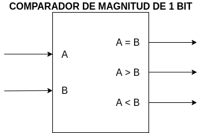
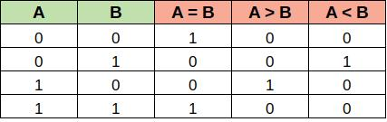
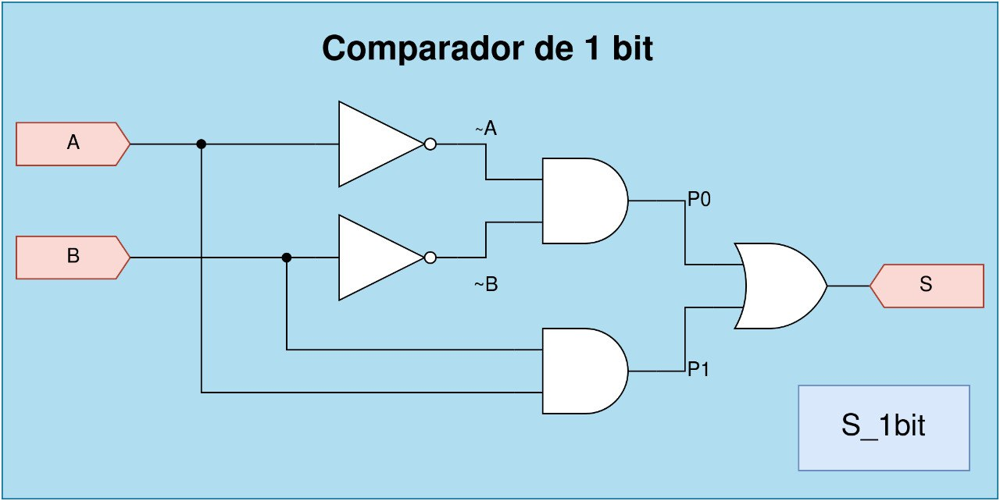
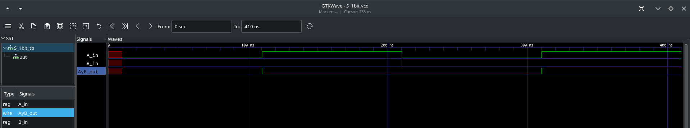

# COMPARADOR DE MAGNITUD DE 1 BIT

[[_TOC_]]

## 1. Descripción

En este ejemplo se diseña un comparador lógico de 1 bit. Este caso sencillo permite poner en práctica el diseño de circuitos digitales a "nivel de compuertas" (*gate-level*), por lo que se usan operaciones lógicas sencillas del HDL.

Un comparador de magnitud es un dispositivo digital **combinacional** que tiene dos entradas (en este caso de 1 bit) y tres salidas de 1 bit cada una, y cuya función es analizar si sus entradas son iguales o diferentes. Esto se puede ver en las siguientes imágenes:




Se observa como cada salida se pone en alto cuando se cumple su condición:

*  A = B
*  A > B
*  A < B 

## 2. Código

Antes de la codificación del comparardor de 1 bit vamos a presentar el circuito esquemático a nivel de compuertas de la salida por igual y se deja al estudiante la implementación de las salidas por mayor y menor.



### 2.1. VERILOG

El código VERILOG es sencillo simplemente se declara el módulo con sus respectivas entradas y salidas. En este ejemplo solo se implementó la salida por igual.

```verilog
module S_1bit(
    input wire A, B,  		//Declaración de los puertos de entrada
    output wire S     		//Declaración del puerto de salida
    );

	wire P0, P1;    			//Declaracíón del tipo de dato
	assign S = P0 | P1;		/*Asignación continua S:salida - P0 y P1 entradas. Forma mas sencilla. de describir lógica - | reŕesenta "or" */
	assign P0= A & B;			// & representa "and"//
	assign P1= ~A & ~B;		//~ representa "not"
endmodule
```

Para ver el archivo **.v** completo del comparador, ir [aquí](S_1bit.v).

## 3. Simulación

Como se trata de un **circuito combinacional**, se diseña un *testbench* para probar de **forma exhaustiva** al comparador. En otras palabras, se le van a inyectar todas las combinaciones posibles de las entradas y se verificarán los valores de las 
salidas, tal cual aparece en la tabla de verdad. Recordar que para este caso en particular solamente se implementó la salida por igual.

### 3.1. *Testbench* en Verilog

Como primer paso en la realización del **testbench** es la definición de la escala de tiempo que se va a utilizar.

```verilgog
`timescale 1ns / 100ps
```

donde timesscale "unidad de tiempo" / "precisión", para este caso en particular la unidad de tiempo corresponde a 1ns y la precisión de la simulación a 100ps.

Una vez definida la escala de tiempo de la simulación se procede a declarar un módulo con la misma cantidad de entradas y salida del módulo que quiero evaluar.

```verilog
module S_1bit_tb;

	// Inputs
	reg  A_in;
	reg  B_in;

	// Outputs
	wire AyB_out;
```

Una vez declarado el módulo **testbench** se procede a instanciar el módulo de la unidad bajo testeo (Unit Under Test - UUT), o sea, el módulo a testear de la siguiente manera.

```verilog
	// Instantiate the Unit Under Test (UUT)
	S_1bit uut (
		.A(A_in), 
		.B(B_in), 
		.S(AyB_out)
	);
```

las entradas de la UUT van con un punto por delante y el estímulo entre paréntesis. En este caso se le ingresan a la UUT **A_in** y **B_in** y la UUT devuelve, a través de su salida **S**, el resultado en la salida **AyB_out** para ser monitoreado. 

Una vez instanciada la UUT se procede a generar la lista de estímulos para ser inyectados a nuestro módulo de prueba, esto se puede apreciar en el siguiente código:

```verilog

initial begin
		// Estimulo 1
		A_in = 1'b0;
		B_in = 1'b0;

		#100;
		// Estimulo 2
		A_in = 1'b1;
		B_in = 1'b0;
		
		#100;
		// Estimulo 3
		A_in = 1'b0;
		B_in = 1'b1;
		
		#100;
		// Estimulo 4
		A_in = 1'b1;
		B_in = 1'b1;
		#100;

	end
```

Observern que entre cada estímulo entregado a la UUT aparece el comando **#100** esto representa que el programa espere 100 unidades de tiempo entre cada uno de los estímulos, para este caso **#100** representa **100ns**. Para ver el archivo **Verilog** completo del *testbench*, ir [aquí](S_1bit_tb.v).

### 3.2. Resultados

En la siguiente imagen se aprecian las formas de onda visualizadas con gtkWave, donde se usaron marcadores para identificar las partes principales.



Como se observa en la figura anterior en el borde superior izquierdo aparece nuestro **módulo testbench** y dentro de el la instanciación de la **UUT**.
En el cuadro inferior aparecen los estímulos utilizados **A_in** y **B_in** junto con la variable de monitoreo **AyB_out**. 
Finalmente a la derecha se observan las formas de onda que se generaron a partir de los estímulos introducidos se aprecia que:

- Cuando **A_in** es igual a **B_in**, la salidad **AyB_out** es igual a **1**
-  Cuando **A_in** es distinto a **B_in**, la salidad **AyB_out** es igual a **0**

Se observa como la salida del comparador cumple con el comportamiento 
deseado, quedando así verificado el diseño.

Se propone como trabajo inicial que se realize el comparador de un bit contemplando la posibilidad de que:
- **A** sea mayor a **B** 
- **A** sea menor a **B** 

## 4. Implementación y ensayo

Para implementar el diseño anterior en la [EDU-FPGA] se debe tener en cuenta lo siguiente:
* ¿Cómo voy a estimular al comparador?
* ¿Cómo voy a ver el estado de las salidas? 

Como en muchos ejemplos simples, para responder estas cuestiones se hace uso de los **pulsadores** y los **LED** embebidos en la placa: los primeros se conectan a las entradas del comparador y los últimos a sus salidas. 

### 4.1. Código de la implementación


### 4.2. Asignación de pines

Para este caso, la asignación de pines es:

|  **Componente embebido**  |  **Pin FPGA**     |   **Pin comparador**  |
|:-------------------------:|:----------------: |:---------------------:|
|  Pulsador 1               |       31          |   A                   |
|  Pulsador 2               |       32          |   B                   |
|  LED 1                    |       1           |   AyB                 |

Para ver el archivo **.pcf** ir [aquí](S_1bit.pcf), y para el pinout de la EDU-FPGA ir [aquí](https://github.com/ciaa/Hardware/blob/master/PCB/EDU-FPGA/Pinout/Pinout%20EDU%20FPGA.pdf).

### 4.3. Ensayo

Entonces se sintetiza e implementa el diseño en la placa, apreciándose su 
funcionamiento en el siguiente GIF:


Se observa en orden:
1. **Con ningúno de los pulsadores presionados**, ambas entradas quedan internamente en 0, por lo tanto el LED 1 (eq_out) se enciende.
2. **Con solo el pulsador 1 presionado**, únicamente la entrada a_in queda internante en 1, por consiguiente se enciende el LED 2 (gt_out).
3. **Con solo el pulsador 2 presionado**, únicamente la entrada b_in queda internante en 1, por lo tanto se enciende el LED 3 (lt_out).
4. **Con los dos pulsadores presionados**, ambas entradas quedan internamente en 1, por  consiguiente el LED 1 (eq_out) se enciende.

---

