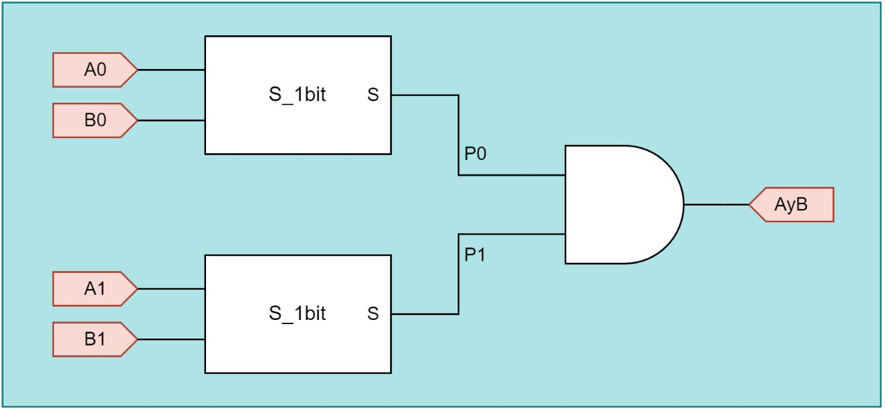

# COMPARADOR DE MAGNITUD DE 2 BIT

[[_TOC_]]

## 1. Descripción

En este ejemplo se diseña un comparador lógico de 2 bit considerando las tres alternativas que tenemos en Verilog para la descripción de Hardware.

* Por asignaciones continuas.
* Por instanciación de módulos.
* Por comportamiento - Inferencia.

Un comparador de magnitud es un dispositivo digital **combinacional** que puede tener dos entradas (en este caso de 2 bit cada una) y tres salidas de 1 bit cada una, y cuya función es analizar si sus entradas son iguales o diferentes. Se va a realizar un comparador por igual o distinto dejando al estudiante la implementación de las salidas por mayor y menor.

## 2. Asignaciones continuas.
Este tipo de asignaciones se da para declaraciones donde las conexiones (wire) se conectan permanentemente a un valor constante o una expresión compuesta por un grupo de señales.
Para poder interpretar de manera correcta el funcionamiento de este comparador es necesario conecer su tabla de verdad, la cual se aprecia en la siguiente figura.


### 2.1. Código Verilog

Antes de la codificación del comparardor de 2 bit vamos a presentar el circuito esquemático a nivel de compuertas de la salida por igual y este circuito es el que debemos describir con Verilog en nuestro módulo. 


En el código Verilog simplemente se declara el módulo con sus respectivas entradas y salidas. Como así también el uso de señales internas necesarias.

```verilog
module S_2bit ( 
	input wire [1:0] A, B,
	output wire AyB
	);

wire P0, P1, P2, P3; // Declaración interna de señales
assign AyB = P0 | P1 | P2 | P3; // Suma de los términos producto

// Términos producto
assign P0 = (~A[1] & ~B[1]) & (~A[0] & ~B[0]);
assign P1 = (~A[1] & ~B[1]) & (A[0] & B[0]);
assign P2 = (A[1] & B[1]) & (~A[0] & ~B[0]);
assign P3 = (A[1] & B[1]) & (A[0] & B[0]);
endmodule

```


## 3. Instanciación de Módulos
Este proceso de descripción de hardware se base en la vista estructural, es decir a partir de un diagrama en bloques que describe los componentes y su interconexiones. Este diagrama se puede observar en la siguiente figura



### 3.1. Código Verilog
Dentro del archivo Verilog, ahora se deben definir dos bloques **S_1bit** que representan a un comparador de 1 bit, este tipo de descripción se utiliza para aprovechar módulos realizados y que ya fueron testeados correctamente. Este comparador de dos bits se basa en dos comparadores de 1 bits y cada uno de ellos es tomado como una UUT (Unit Under Test) respetando sus entradas y salidas.

```Verilog
module S_2bit(
    input wire [1:0] A,  //Definición del wire de 2 bits
    input wire [1:0] B,  //Definición del wire de 2 bits
    output wire AyB
    );
wire P0, P1;      //Declaración interna de señales
S_1bit uut0 (.A(A[0]), .B(B[0]), .S(P0));  //Instanciación
S_1bit uut1 (.A(A[1]), .B(B[1]), .S(P1));
assign AyB=P0 & P1;    //Asignación continua 
endmodule
```

Luego, tenemos una asignación continua de la salida AyB con las señales internas P0 y P1. Para ver el archivo **.v** completo del comparador, ir [aquí](S_2bit.v).

## 4. Por comportamiento - Inferencia
En este caso se realiza una descripción funcional del bloque y a partir de este comportamiento, el sintetizador infiere directamente el comparador. Esta forma de descripción se realiza a través de **Always Block** que tienen como entrada una lista de señales con un nivel de sensibilidad.


### 4.1. Código Verilog
```Verilog
 module S_2bit
( input wire [1:0] A,B,
 output reg AyB);
 // Uso del always block
Always @ *   //El * representa a todas las señales
if (A == B)
   AyB = 1'b1;
else
   AyB = 1'b0;
endmodule
```


## 5. Simulación

Como se trata de un **circuito combinacional**, se diseña un *testbench* para probar de **forma exhaustiva** al comparador. En otras palabras, se le van a inyectar todas las combinaciones posibles de las entradas y se verificarán los valores de las 
salidas, tal cual aparece en la tabla de verdad. Se deja como ejercicio para este workshop la realización del testbench para cualquiera de las formas de descrbir hardware que se explicaron en los puntos anteriores.

## 6. Implementación y ensayo

Para implementar el diseño anterior en la [EDU-FPGA] se debe tener en cuenta lo siguiente:
* ¿Cómo voy a estimular al comparador?
* ¿Cómo voy a ver el estado de las salidas? 

Como en muchos ejemplos simples, para responder estas cuestiones se hace uso de los **pulsadores** y los **LED** embebidos en la placa: los primeros se conectan a las entradas del comparador y los últimos a sus salidas. 

### 6.1. Asignación de pines

Para este caso, la asignación de pines es:

|  **Componente embebido**  |  **Pin FPGA**  |  **Pin comparador**  |
|:-------------|:----------------: |:-------------:|
|  Pulsador 1  |       31          |   A0           |
|  Pulsador 2  |       32          |   B0           |
|  Pulsador 3  |       33          |   A1           |
|  Pulsador 4  |       34          |   B1           |
|  LED 1       |       1           |   AyB          |

Para ver el archivo **.pcf** ir [aquí](S_2bit.pcf), y para el pinout de la EDU-FPGA ir [aquí](https://github.com/ciaa/Hardware/blob/master/PCB/EDU-FPGA/Pinout/Pinout%20EDU%20FPGA.pdf).

---

