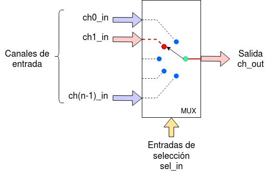
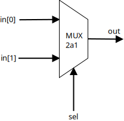
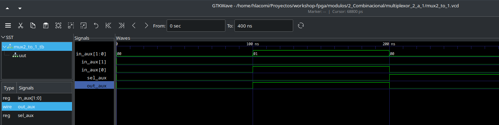

# Multiplexor de 2 canales de 1 bit

[[_TOC_]]

## 1. Descripción

Un multiplexor es un circuito combinacional el cual funciona como una "llave selectora" ya que el código de las entradas de selección determina cual de los ocho canales se transmite a la salida. 



Se diseña un **multiplexor** (o *mux*) de 2 canales con entradas de un bit para que este pueda ser implementado en la placa.



El cual cumple la siguiente condición lógica:
1. Si la entrada **sel** está en **0**, la entrada **in[0]** se refleja en la salidad **out**.
2. Si la entrada **sel** está en **1**, la entrada **in[1]** se refleja en la salidad **out**.


## 2. Código

### 2.1 Verilog

Como primer paso vamos a definir el módulo con sus entradas y salidas. En este caso tendría 2 entradas y una salida

```Verilog
module mux2_to_1
    (input wire [1:0] in,
    input wire sel, //Selección de la entrada
    output reg  out //salida del mux
    );
```

Luego vamos a definir por comportamiento la lógica que debe poseer el multiplexor, esto lo realizamos a través de un **always block**

~~~Verilog
always@(*)
    begin
        sel_in = sel;
        case(sel_in)
            1'b0: out=in[0];
            1'b1: out=in[1];
            default: out=1'b0;
        endcase
    end
~~~
Cabe aclarar que es muy importante definir el caso por **default** (en caso de que no se cumpla ninguna de las condiciones planteadas) para asegurar que el comportamiento del módulo esta bien definido para todos los casos posibles.

[Aquí](mux2_to_1.v) podrá encontrar el código completo.

    
## 3. Simulación
### 3.1 *Testbench* en Verilog
Como el multiplexor es un **circuito combinacional** ya que el estado de su salida depende solo del estado de sus entradas, vamos a verificar el diseño de **forma funcional**, es decir probando algunas de las combinaciones de sus entradas y comprobar que las salidas correspondientes cumplan con la lógica planteada.

Para generar el *testbech* se utilizó un módulo con las mismas características que el módulo a testear. Es decir dos entradas y una salida

~~~ Verilog
module mux2_to_1_tb; 
    //Inputs
    reg [1:0] in_aux;//input
    reg  sel_aux;   //selection
    wire out_aux;        //output
~~~

Luego se debe instanciar el módulo a evaluar como una *Unit Undert Test* asignando sus entradas con los estímulos que se van a generar.

~~~ Verilog
 mux2_to_1 uut (        //mux2_to_1 es el nombre del módulo a ensayar
        .in(in_aux),
        .sel(sel_aux),
        .out(out_aux)
    );
~~~

Luego se generan los estímulos a la UUT

~~~Verilog
// Initialize inputs
            in_aux = 2'b00;
            sel_aux = 1'b0;
            #100;  //espera 100ns
            //Espera 100ns para cada conmutación
            
            //Estímulo 1 entrada 1
            in_aux = 2'b01;
            sel_aux = 1'b0;
            #100;

            //Estímulo 2 entrada 1
            in_aux = 2'b00;
            sel_aux = 1'b1;
            #100;

            //Estímulo 3 entrada 1
            in_aux = 2'b10;
            sel_aux = 1'b1;
            #100;
~~~

[Aquí](mux2_to_1_tb.v) podrán encontrar el testbench utilizado
para simular el diseño.

### 3.2 Resultados



<br>Simulación en GTKWave.

Se observa que la salida del multiplexor cumple con el
comportamiento deseado, quedando así verificado el diseño.

## 4. Implementación y ensayo

Para implementar el diseño anterior en la [EDU-FPGA] se debe tener en cuenta lo siguiente:
* ¿Cómo voy a estimular al comparador?
* ¿Cómo voy a ver el estado de las salidas? 

Como en muchos ejemplos simples, para responder estas cuestiones se hace uso de los **pulsadores** y los **LED** embebidos en la placa: los primeros se conectan a las entradas del multiplexor y los últimos a sus salidas. 

### 4.1. Asignación de pines

Para este caso, la asignación de pines es:

|  **Componente embebido**  |  **Pin FPGA**  |  **Pin comparador**  |
|:-------------|:----------------: |:-------------:|
|  Pulsador 1  |       31          |   in[0]       |
|  Pulsador 2  |       32          |   in[1]       |
|  Pulsador 3  |       33          |   sel         |
|  LED 1       |       1           |   out         |

Para ver el archivo **.pcf** ir [aquí](mux2_to_1.pcf), y para el pinout de la EDU-FPGA ir [aquí](https://github.com/ciaa/Hardware/blob/master/PCB/EDU-FPGA/Pinout/Pinout%20EDU%20FPGA.pdf).
