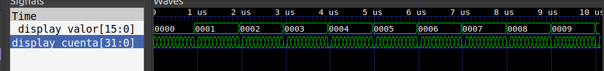

# 04 - Contador Hexadecimal

## Descripción

Este ejemplo es un contador hexadecimal, en donde cada uno de los interruptores aumenta la velocidad del contador.

Las diferentes combinaciones de los interruptores controlan directamente la velocidad, pudiendo ir por defecto desde 0 hasta 16 [$\frac{incrementos}{segundo}$]

Esencialmente funciona como un divisor de frecuencia configurable, en donde CLK_SND es la cantidad de cuentas que el dispositivo realiza hasta aumentar el contador
Utilizar un CLK_SND igual a la frecuencia del CLOCK resulta en 1[$\frac{incremento}{segundo}$]

vcontador = $\large\frac{f_{clk}}{CLK_{SND}}$

### Circuito funcionando

-+-+-+-+-+-+-+-+-+-+-+-
 

 
-+-+-+-+-+-+-+-+-+-+-+-

## Diseño

## Simulación

En la simulación se debe parametrizar la variable CLK_SND a un valor razonable si se quiere visualizar incrementos de display_valor sin necesidad de extender innecesariemente el tiempo de simulación
Por defecto se configura 12

### Resultados

Se aprecia que cada 12 pulsos de clock el valor del display es incrementado en una unidad

## Ejercicio Propuesto

1. Diseñar un contador que tenga una frecuencia de 50Hz
Comprobar mediante simulación y sintetizar

2. ¿Es posible diseñar un contador con una velocidad superior a la del clock? ¿Por qué?
