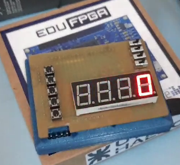
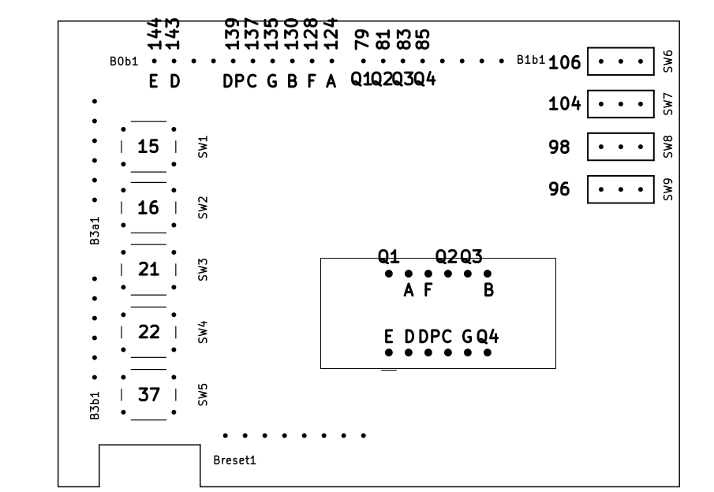

# 3.5 - Poncho

[TOC]

## Descripción

Este directorio contiene ejemplos de uso del *poncho*, un hardware periférico que se conecta a la EDU-FPGA y le incorpora pulsadores, interruptores y displays de 7 segmentos para interactuar con los circuitos digitales que se sinteticen.




## Ejemplos Disponibles

- [Sumador de Pulsos](./Sumador_Pulsos)
- [Contador Hexadecimal](./Contador_Hexadecimal)

## Hardware Periférico Utilizado

El poncho cuenta consta de los siguientes dispositivos:
- 5 pulsadores.
- 4 interruptores.
- 4 displays de siete segmentos cátodo común.

La conexión de cada uno con los pines de la FPGA se indica a continuación:




| Dispositivo              | Pin asociado                |
|--------------------------|-----------------------------|
| Pulsadores               | 15-16-21-22-37              |
| Interruptores            | 106-104-98-96               |
| Displays (segmentos a-g) | 124-130-137-143-144-128-135 |
| Displays (cátodos 0-3)   | 85-83-81-79                 |
| Displays (punto decimal) | 139                         |

### Indicaciones para el Uso


#### Pulsadores e Interruptores

Los pulsadores del poncho son activos en bajo y no tienen resistores de pull-up. **Para asegurar la correcta detección de los niveles lógicos cuando se usan estos pulsadores hace falta activar los resistores de pull-up internos de la FPGA**. Esto se hace agregando `-pull-up yes` a las asignaciones en el constraints file:

```tcl
    set_io -pullup yes btn_0_in 15
```
Los pulsadores e interruptores no tienen ningún filtro incorporado para suprimir el efecto del rebote cuando se utilizan. El usuario debe instanciar un [módulo antirrebote](Sumador_Pulsos/debounce) por cada botón/interruptor para evitar las señales espurias que se generan.


#### Displays

La forma en qué se implementó la conexión de los displays a la FPGA requiere del uso de un módulo diseñado para controlar los dígitos, [display_driver](Sumador_Pulsos/display_driver). El subdirectorio de dicho módulo explica en mayor detalle la cuestión.
