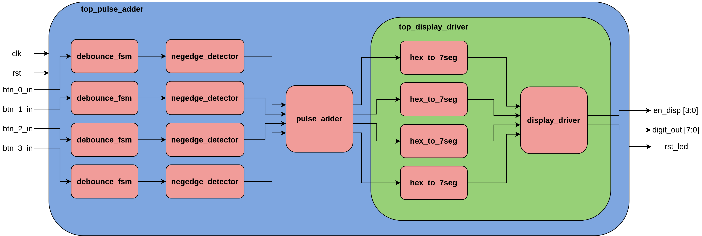
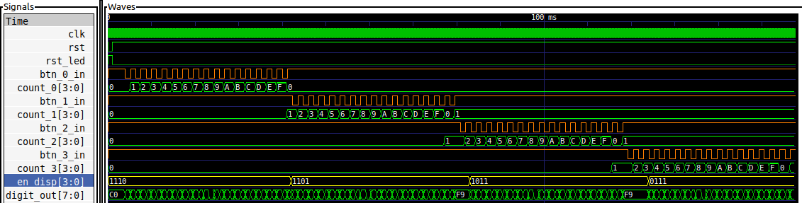
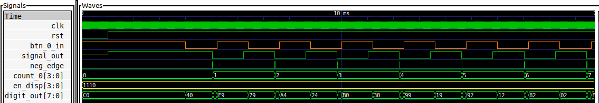

# Sumador de Pulsos
[TOC]
## Descripción

Este ejemplo es un sumador de pulsos simple, en donde cada uno de los botones del poncho sirven para aumentar en 1, 16, 256 o 4096 el valor de un registro que se muestra en los displays en formato hexadecimal.

Uno de los interruptores funciona como RESET.
Al activarse se carga el valor 0 en el registro del sumador y se resetean todos los módulos internos del sistema.

## Submódulos
El sumador de pulsos utiliza internamente los siguientes submódulos:

#### 1. [Antirrebote](debounce/)

#### 2. [Detector de Flanco (Negativo)](negedge_detector/)

#### 3. [Driver de Displays de 7 Segmentos](display_driver/)

### Circuito funcionando

## Diseño

Los submódulos que componen el sumador de pulsos se instancian e interconectan dentro de un toplevel ([top_pulse_adder.v](top_pulse_adder.v)) siguiendo el siguiente diagrama:

- Las señales generadas por cada pulsador son filtradas usando un circuito antirrebote y el resultado pasa a un detector de flanco negativo.
- El módulo [pulse_adder](pulse_adder/pulse_adder.v) registra cada pulso y suma el valor correspondiente al registro interno.
- El valor correspondiente a cada dígito se envía al módulo [top_display_driver](display_driver/top_display_driver.v), que controla los displays de 7 segmentos del poncho.

## Simulación

El testbench [top_pulse_adder_tb.v](top_pulse_adder_tb.v) permite instanciar y simular el sumador de pulsos completo. Para facilitar la visualización del funcionamiento interno del dispositivo, la frecuencia de clock utilizada en la simulación es de 100 kHz y el tiempo de espera por rebote es de 1 ms.

Cada submódulo tiene su propio testbench de evaluación en el subdirectorio correspondiente.

### Cómo Simular

Para simular, [seguir los pasos indicados en unidades anteriores](../../3_Secuencial/) sobre el uso de la extensión de la EDU-CIAA-FPGA para Vscode o hacerlo mediante un script de bash.

### Resultados

## Ejercicio Propuesto

1. Modificar el sumador para que reste en lugar de sumar.

