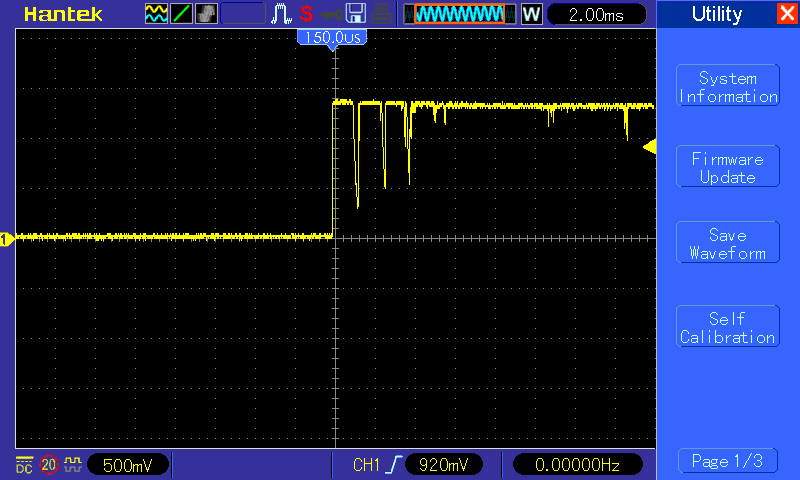
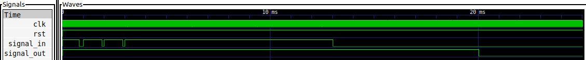

# Antirrebote

Adaptación a Verilog del ejemplo [13-Antirrebote](https://gitlab.com/educiaafpga/ejemplos/-/tree/master/Ejemplos_Base/13-Antirebote?ref_type=heads) del [Repositorio de Ejemplos de la EDU CIAA FPGA](https://gitlab.com/educiaafpga/ejemplos/-/tree/master?ref_type=heads). 

Se recomienda ver el proceso de verificación descrito en la documentación original de este ejemplo, dado que es más abarcativo que la simulación presentada en esta adaptación.

## Descripción

### Introducción al problema

El rebote es un fenómeno que existe en los contactos mecánicos cuando estos cambian de un estado a otro (por ejemplo de abierto a cerrado, o al revés). Durante el rebote (el cual puede durar un tiempo en el orden de milisegundos), el contacto presenta oscilaciones que impiden determinar su estado lógico. En la siguiente imagen se puede notar el efecto del rebote en una transición de 0 a 1:

Este fenómeno puede solucionarse mediante filtros RC o bien mediante un algoritmo que lo detecte, de forma tal que este no afecte al resto de la lógica del sistema.

Aquí, se presentará una solución antirebote mediante FSM. Su funcionamiento se explica brevemente de la siguiente manera: cuando la FSM detecta un cambio de nivel en la entrada, pone a correr un timer durante un **tiempo fijo**. Luego de este tiempo, la FSM lee el nivel presente en la entrada y determina si el estado corresponde a un uno o un cero. En pocas palabras, cada vez que cambia el nivel lógico de entrada, la máquina espera un tiempo determinado y recién entonces determina efectivamente el estado lógico de la señal, esperando que pase el transitorio del rebote. 

## Simulación

Para facilitar la visualización del funcionamiento del circuito, en el test [debounce_fsm_tb.v](debounce_fsm_tb.v) se utilizó una frecuencia de clock de 100 kHz y tiempo de espera de 7 ms. Para simular el efecto del rebote de un pulsador, se conmuto el valor de la entrada varias veces antes de que el timer terminara de contar.

