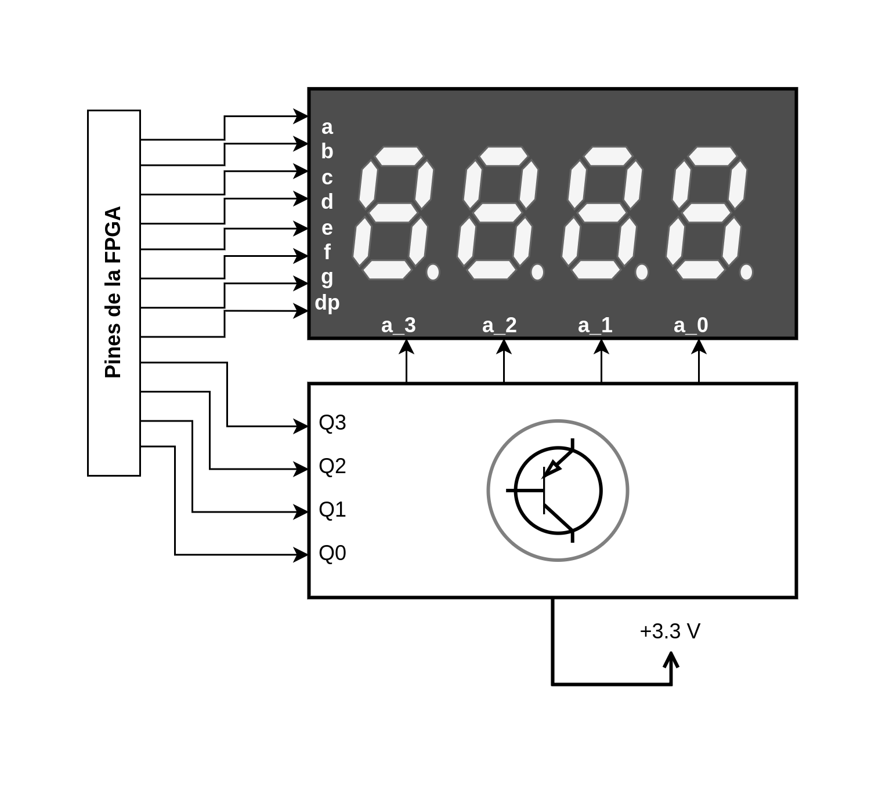
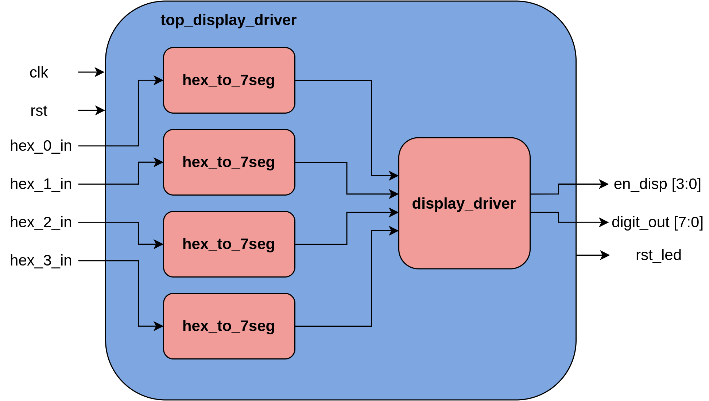
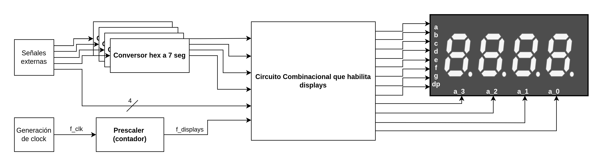
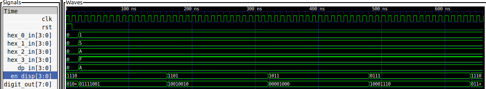

# Driver de Displays de 7 Segmentos

## Descripción

### Introducción al Problema

El poncho fue diseñado para conectar la mayor cantidad de displays posible usando la menor cantidad pines de la FPGA, por lo que los segmentos de todos los displays están conectados entre sí y el usuario debe seleccionar el display que se activa asignando un 1 o un 0 al ánodo correspondiente.

 

Esta forma de conexión implica una dificultad. Si el dígito mostrado por un display depende de los segmentos encendidos y todos los displays tienen sus segmentos conectados ¿Cómo pueden mostrarse dígitos diferentes en cada display?

La forma de hacerlo es mediante una **multiplexación en el tiempo** de los displays. Se enciende y apaga cada display de forma sucesiva, lo suficientemente rápido para que a la vista parezcan siempre encendidos. Como solo un display está encendido a la vez, en ese tiempo se puede asignar el valor correspondiente de los segmentos.

El resultado obtenido es el siguiente:

Con mayor frecuencia de actualización de los displays:

## Submódulos

Para manejar los displays se instancian dos submódulos:

#### 1. [Conversor de Código Hexadecimal a 7 Segmentos](./hex_to_7seg.v)

#### 2. [Driver de los Displays](./display_driver.v)

## Diseño

Controlar los displays disponibles implica dos cuestiones fundamentales que deben resolverse:
- Convertir los valores a mostrar del código de origen a 7 segmentos ánodo común.
- Conmutar los displays para que solo uno este encendido a la vez.

El diagrama de la solución propuesta es el siguiente:

- Los valores a mostrar en los displays son convertidos al código de 7 segmentos.
- El módulo [display_driver](./display_driver.v) toma las señales resultantes y se las pasa a los segmentos cuando habilita el display correspondiente.

El mecanismo por el cual se conmutan los displays es básicamente un contador que actúa como divisor de frecuencia, lo que comunmente se conoce como *prescaler*. La frecuencia de conmutación se determina como 

$$f_{displays} = \frac{f_{clock}}{2^{PRESCALER\_BITS}}$$ 

Siendo $PRESCALER\_BITS$ un parámetro del módulo display_driver que se define al momento de instanciarlo.

Dado que hay 4 displays sobre los que conmutar, se toman los últimos 2 bits del registro del contador para definir cuando habilitar cada display. 

El diagrama general de los conceptos aplicados para controlar los displays es el siguiente:

## Simulación

El test [top_display_driver_tb](./top_display_driver_tb.v) permite instanciar y simular el top level para ver como responde el módulo ante los estímulos generados.

## Ejercicio Propuesto

1. La implementación hecha del driver requiere un conversor de hexadecimal a siete segmentos por cada uno de los dígitos. Sin embargo, solo uno de estos está activo a la vez. Modificar el archivo [display_driver.v](/display_driver.v) para que reciba como entrada el código BCD del número a mostrar en cada display y haga la conversión usando solo un conversor. Comparar el uso de recursos con la implementación previa.
