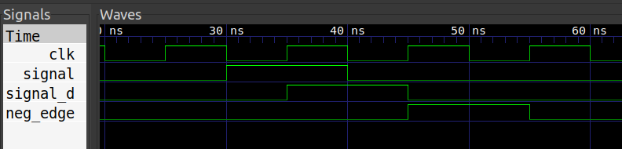

# Detector de Flanco (Negativo)

## Descripción 
Consiste en un detector de flancos. Se utiliza en el ejemplo del [sumador de pulsos](../) para la detección de cada pulsación individual de los botones del hardware periférico.

El detector recibe una señal asincrónica debida a una pulsador **(`signal`)** y genera una señal interna retrasada exactamente 1 ciclo de reloj **(`signal_d`)**. La salida **(`neg_edge`)** es función de ambas y cuando ocurre una transición de nivel alto a nivel bajo de tensión pasa a 1.

Tabla de la verdad entre señales:

| signal | ~signal | signal_d | neg_edge |
|--------|---------|----------|----------|
| 0      | 1       | 0        | 0        |
| 0      | 1       | 1        | 1        |
| 1      | 0       | 0        | 0        |
| 1      | 0       | 1        | 0        |

## Simulación

## Ejercicio Propuesto

1. Implementar un detector de flancos positivos.