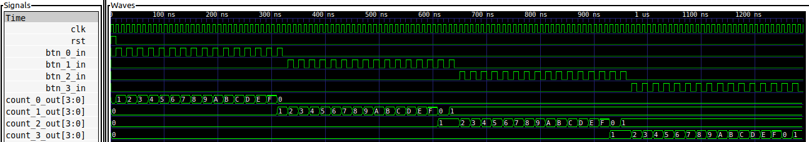

# Sumador de Pulsos

## Descripción 
Submódulo que hace las sumas en el ejemplo del [sumador de pulsos](../). Tiene cuatro señales de 4 bits como salida, cada una correspondiente al valor de un dígito. 

## Simulación

El test [pulse_adder_tb.v](pulse_adder_tb.v) permite instanciar y simular el sumador de pulsos para ver como responde el módulo ante los estímulos generados.

