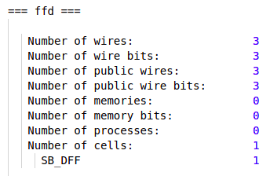
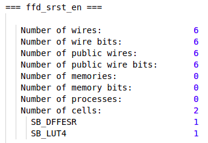
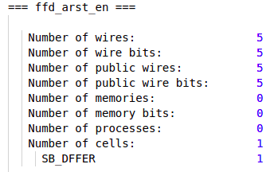
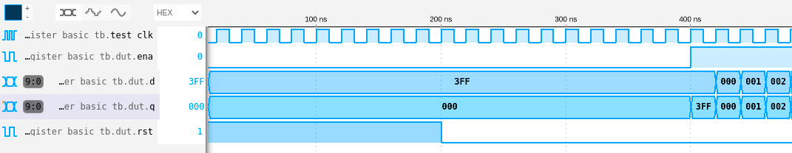

# 01 - FFD - Registros

## Descripción

Esta sección presenta distintas maneras de codificar Flip-Flops:

- Flip-Flop D: [ffd.v](./ffd.v)
- Flip-Flop D con enable y reset asincrónico: [ffd_arst_en.v](./ffd_arst_en.v)
- Flip-Flop D con enable y reset sincrónico: [ffd_srst_en.v](./ffd_srst_en.v) 

A su vez, el ejemplo [register.v](./register.v) permite ver cómo se crea un registro a partir de Flip-Flops (incrementando el número de puertos de entrada/salida).

## Síntesis e implementación de Flip-Flops

Para sintetizar los ejemplos y verificar los recursos utilizados, se pueden seguir los pasos descriptos en el [README de esta unidad](../README.md). Los mismos se repiten aquí para mayor claridad:

- Abrir Vscode en esta carpeta.
- Conectar la EDU-CIAA-FPGA al puerto USB.
- Usando el atajo **Ctrl+Shift+p**, elegir la opción  **EDU-CIAA-FPGA: Verilog Toolchain from Docker**.
- Indicar el archivo ***.pcf** con los constraints de entrada/salida. Por ejemplo, para el [ffd.v](./ffd.v) sería [ffd.pcf](./ffd.pcf). Para los ejemplos [ffd_srst_en.v](./ffd_srst_en.v) y [ffd_arst_en.v](./ffd_arst_en.v), el archivo de constraints es [ffd_xrst_en.pcf](./ffd_xrst_en.pcf) (mismo para ambos).
- Indicar el archivo del top level que corresponda a cada ejemplo.

Los resultados de síntesis deberían mostrar lo siguiente para cada caso:

### ffd.v



### ffd_srst_en.v



### ffd_arst_en.v



## Simulación

El test [register_basic_tb.v](./register_basic_tb.v) permite instanciar y simular un registro para ver sus formas de onda. Para simular, seguir los pasos indicados en el [README de esta unidad](../README.md).



### Descripción del test

#### Include y nombre del módulo:

```verilog

`timescale 1 ns/100 ps
`include "register.v"

module register_basic_tb();

```

- La directiva **`timescale** fija la unidad de tiempo en 1 ns, con resolución de 100 ps.
- La directiva **`include** se utiliza para incluir el archivo fuente con el diseño. En este caso sería [register.v](./register.v)
- El módulo del testbench se declara sin parámetros ni puertos de entrada/salida, ya que toda la lógica queda contenida dentro del test. 

#### Parámetros locales:

Se utilizan estos parámetros para definir:

- **PER2**: la duración (en nanosegundos) de medio período de clock.
- **N**: la cantidad de bits que tendrá el registro a probar.

```verilog

//Parámetros locales del test:
localparam PER2         = 10.00;
localparam N            = 10;

```

#### Señales del DUT:

Estas señales se utilizarán para conectarse al DUT (*Device Under Test*). Notar que las **entradas** del DUT se declaran del tipo **reg**, ya que sus valores serán asignados dentro de bloques **always** o **initial**. Por otro lado, las señales que se conectan a salidas del DUT se declaran del tipo **wire**, ya que en este caso es el DUT quien asigna un valor a las mismas. Esto último resulta equivalente a utilizar asignaciones del tipo **assign**.

```verilog

//Señales del DUT:
reg          test_clk ;
reg          test_rst ;
reg  [N-1:0] test_d   ;
reg          test_ena ;
wire [N-1:0] test_q   ;

```

#### Señales internas:

Entero i para utlizar en un for loop.

```verilog

//Señales internas:
integer i = 0;

```

#### DUT:

Instanciación del DUT. Comienza con el nombre del módulo (*register*), seguido de las asignaciones de parámetros (en este caso solo existe el parámetro N). Luego se indica el nombre de la instancia (*dut*), seguido de la asignación de puertos de entrada / salida.

```verilog

//DUT:
register 
#(
    .N(N)
)
dut
(
    .clk    ( test_clk    ),
    .rst    ( test_rst    ),
    .d      ( test_d      ),
    .ena    ( test_ena    ),
    .q      ( test_q      )
);

```

#### Generación de clock:

El clock, al ser una señal continua, se asigna dentro de un bloque **always** sin especificar una lísta de sensibilidad. Se utiliza el parámetro **PER2** para invertir el nivel lógico del clock cada medio período.

```verilog

//Generación de clock:
always
begin
    test_clk = 1'b1;
    #PER2;
    test_clk = 1'b0;
    #PER2;
end

```

#### Test:

El desarrollo del test se hace dentro de un bloque **initial**. Este tipo de bloques se ejecutan una única vez al comienzo del test (de ahí su nombre). 

El test comienza indicando el nombre del archivo donde se guardarán las formas de onda. Esto se hace mediante la función **$dumpfile**. Luego, se indica desde qué nivel de jerarquía serán capturadas las señales. En este caso, para capturar las señales del testbench y sus instancias internas (dut), se utiliza la función de Verilog **$dumpvars()** con la opción 0 y el nombre del módulo **register_basic_tb**

El primer argumento de **$dumpvars()** permite indicar cuántos niveles por debajo del módulo indicado serán registrados. Por ejemplo, para registrar únicamente las señales del top level se llama la función con los argumentos "1" y el nombre del módulo:

```verilog

$dumpvars(1,register_basic_tb)

```

Para registrar todas las señales, incluidas aquellas de los bloques internos al testbench (como el DUT), basta con indicar el nivel "0" en el primer argumento. Por lo general, esta última opción será utilizada en todos los tests que aquí se presentan.

Notar también el uso de **asignaciones bloqueantes (=)** para asignar valores a las entradas del DUT. Esto no infiere una unidad de memoria, pero es necesario para modelizar lógica combinacional dentro de bloques del tipo **always** o **initial**. 

```verilog

//Cuerpo del test:
initial 
begin
    $dumpfile("test.vcd");
    $dumpvars(0, register_basic_tb);
    
    $display("Test begins\n");

    test_rst = 1'b1;
    test_ena = 1'b0;
    test_d   = {N{1'b1}};
    #(PER2*20);
    test_rst = 1'b0;
    #(PER2*20);
    test_ena = 1'b1;
    #(PER2*2);

    for(i=0; i<2**N; i=i+1)
    begin
        test_d = i;
        #(PER2*2);
    end

    test_rst = 1'b1;

    #(PER2*10);

    $display("Test end\n");

    $finish();
end

```
