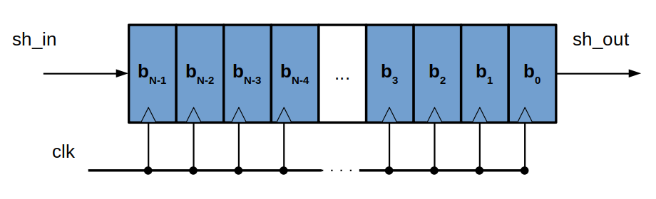
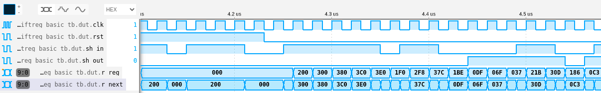

# 02 - Shift register

## Descripción

Aquí se presenta la descripción de un registro de desplazamiento. El mismo se compone de N Flip-Flops D conectados en cascada, tal como muestra el siguiente diagrama:

## Simulación

El test [shiftreg_basic_tb.v](./shiftreg_basic_tb.v) permite instanciar y simular un registro de desplazamiento para ver sus formas de onda. Para simular, seguir los pasos indicados en el [README de esta unidad](../README.md).

