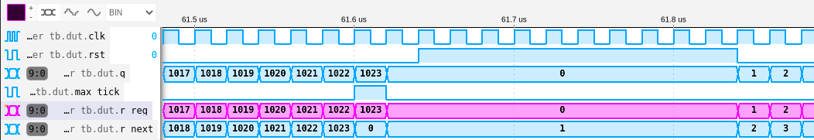

# 03 - Contadores

## Descripción

Aquí se presenta la descripción de un contador clásico, así como el primer ejercicio propuesto de la unidad.

## Simulación

El test [counter_tb.v](./counter_tb.v) permite instanciar y simular un contador para ver sus formas de onda. Para simular, seguir los pasos indicados en el [README de esta unidad](../README.md).

## Ejercicio propuesto: Contador Universal

Ver la consigna en el [README de esta unidad](../README.md)