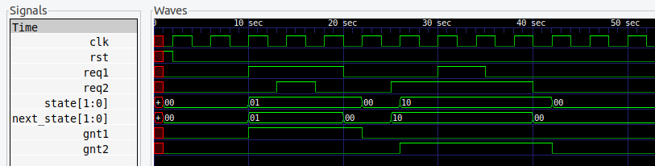

# 04 - Arbiter

## Descripción

Aquí se presenta un arbiter como ejemplo para diseño de FSM.

## Simulación

El test [arbiter_tb.v](./arbiter_tb.v) permite instanciar y simular la FSM para ver sus formas de onda. Para simular, seguir los pasos indicados en el [README de esta unidad](../README.md).

## Implementación

- Abrir Vscode en la carpeta que contiene los archivos fuente.
- Conectar la EDU-CIAA-FPGA al puerto USB.
- Usando el atajo **Ctrl+Shift+p**, elegir la opción  **EDU-CIAA-FPGA: Verilog Toolchain from Docker**.
- Indicar el archivo ***.pcf** y el toplevel de este ejemplo ([arbiter.pcf](./arbiter.pcf) y [arbiter.v](./arbiter.v)).

## Ejercicio propuesto: Arbiter Game

Ver la consigna en el [README de esta unidad](../README.md)