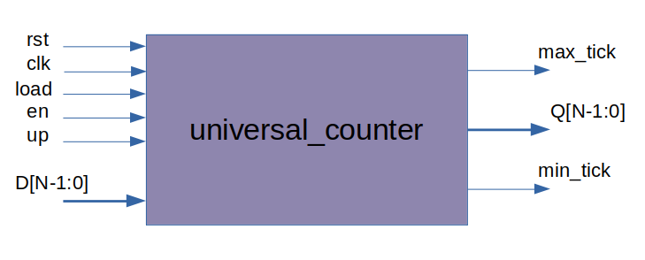
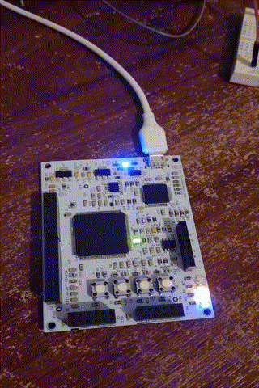
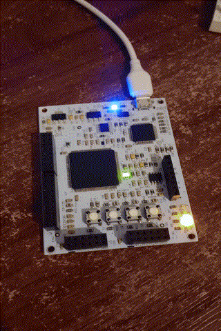
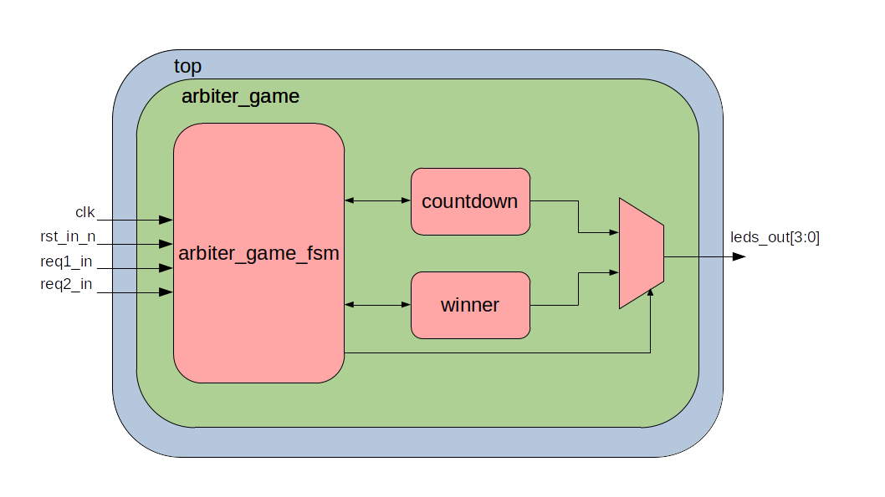
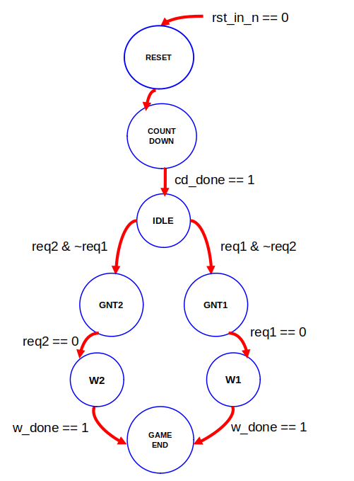

# 3 - Circuitos Secuenciales

[TOC]

## Descripción

En este directorio se pueden encontrar diferentes ejemplos de circuitos secuenciales, muchos de los cuales son utilizados frecuentemente. A su vez, dentro de los directorios [03-Contadores](./03-Contadores/) y [05-Arbiter_Game](./05-Arbiter_Game/) se encuentran los ejercicios propuestos para esta unidad.

## Cómo simular

La primer opción es utilizar la extensión de la **EDU-CIAA-FPGA** desde **Vscode**:

- Abrir Vscode en la carpeta que contiene los archivos fuente.
- Usando el atajo **Ctrl+Shift+p**, elegir la opción  **EDU-CIAA-FPGA: Icarus Verilog from Docker**.
- Indicar el archivo ***.vcd** que genera el test con las formas de onda. Para todos los ejemplos de esta unidad es **test.vcd**.
- Indicar el archivo del test. Por ejemplo, para el contador: [counter_tb.v](./03-Contadores/counter_tb.v).

La segunda opción es usando el script [docker_iverilog.sh](./docker_iverilog.sh):

- Abrir un terminal en la carpeta que contiene los archivos fuente.
- Ejecutar el script con el intérprete **bash**, indicando los archivos de test y formas de onda:

```bash

bash ../docker_iverilog.sh counter_tb.v test.vcd

```

## Cómo generar un bitstream y descargarlo a la placa

- Abrir Vscode en la carpeta que contiene los archivos fuente.
- Conectar la EDU-CIAA-FPGA al puerto USB.
- Usando el atajo **Ctrl+Shift+p**, elegir la opción  **EDU-CIAA-FPGA: Verilog Toolchain from Docker**.
- Indicar el archivo ***.pcf** con los constraints de entrada/salida. Por ejemplo, para el [04-Arbiter](./04-Arbiter/) sería [arbiter.pcf](./04-Arbiter/arbiter.pcf).
- Indicar el archivo del top level. Por ejemplo, para el arbiter: [arbiter.v](./04-Arbiter/arbiter.v).

### Archivo *Physical Constraints File* (.pcf)

Los archivos de extensión **.pcf** que se encuentran en este repositorio permiten asociar las interfaces de entrada/salida de un diseño con los pines de la FPGA. 

La sintaxis es sencilla: se indica mediante el comando *set_io* + nombre del puerto + número de pin. Ejemplo:

```tcl

set_io req1 31
set_io req2 34
set_io rst 33
set_io clk 94
set_io gnt1 1
set_io gnt2 4

```

Para el caso de la **EDU-CIAA-FPGA**, el listado de pines con su numeración se puede encontrar en el [repositorio de ejemplos](https://gitlab.com/educiaafpga/ejemplos/-/blob/master/EDU_CIAA_FPGA.pcf). A su vez se dispone de un esquema en .pdf con el conexionado dentro del [repositorio de hardware](https://github.com/ciaa/Hardware/blob/master/PCB/EDU-FPGA/Pinout/Pinout%20EDU%20FPGA.pdf) de la CIAA.

Otra aplicación importante que tiene este archivo de constraints es la de indicar la frecuencia de trabajo del clock (o los clocks) en el diseño. Por ejemplo, utilizando el comando *set_frequency* + nombre del puerto + frecuencia en MHz:

```tcl

set_frequency clk_input 50

```

Especificar la frecuencia del clock en el diseño es importante para que las herramientas de análisis de *timing* calculen con mayor exactitud la frecuencia máxima de operación del circuito. 

## Actividades propuestas

### 1 - Contador universal

#### Introducción

Tomando como ejemplo al [counter.v](./03-Contadores/counter.v), agregar la lógica necesaria al archivo [universal_counter.v](./03-Contadores/universal_counter.v) para implementar un contador que cumpla con la siguiente tabla:

|rst| load | en | up |  Q* |  Operación         |
|---|------|----|----|-----|--------------------|
| 1 |  --  | -- | -- |  0  | Reset asincrónico  |
| 0 |  1   | -- | -- |  D  | Carga paralela     |
| 0 |  0   | 1  | 1  | Q+1 | Cuenta ascendente  |
| 0 |  0   | 1  | 0  | Q-1 | Cuenta descendente |
| 0 |  0   | 0  | -- |  Q  | Pausa              |

#### Diagrama en bloques

El diagrama de la interfaz para el contador propuesto se muestra a continuación:




#### Verificación 

El diseño deberá ser verificado corriendo el test [universal_counter_tb.v](./03-Contadores/universal_counter_tb.v).

### 2 - Arbiter Game

#### Introducción

Partiendo del ejemplo [arbiter.v](./04-Arbiter/arbiter.v), se implementará un juego para 2 jugadores. El mismo se describe a continuación:

- Cada jugador tiene asociado un pulsador de la placa.
- Al resetear el juego, se mostrará una cuenta regresiva en los LEDs de la EDU-CIAA-FPGA.
- Cuando el último LED termina de parpadear, cada jugador deberá presionar su pulsador antes que el oponente.
- El jugador que llega primero, toma control de los LEDs (utilizando la lógica del arbiter).
- Los LEDs de salida harán un shift hacia un lado u otro, dependiendo qué jugador haya ganado el control del hardware.

>Player 1 wins



>Player 2 wins




#### Diagrama en bloques

El hardware del juego se implementa utilizando 3 bloques principales:

- [arbiter_game_fsm.v](./05-Arbiter_Game/arbiter_game_fsm.v): FSM de control.
- [countdown.v](./05-Arbiter_Game/countdown.v): control de LEDs para cuenta regresiva.
- [winner.v](./05-Arbiter_Game/winner.v): control de LEDs dependiente del ganador.

El diagrama en bloques se muestra a continuación:



#### Objetivo

Tomando como referencia lo implementado en [arbiter.v](./04-Arbiter/arbiter.v), agregar la lógica de actualización de estado actual, estado siguiente y salidas en la FSM de [arbiter_game_fsm.v](./05-Arbiter_Game/arbiter_game_fsm.v).

El diagrama de estados y transiciones y la tabla con los valores de las salidas para cada estado se muestran a continuación:




|          | RESET | COUNTDOWN | IDLE  | GNT_1 | GNT_2 |  W1 |  W2 | GAME END  |
|----------|-------|-----------|-------|-------|-------|-----|-----|-----------|
|     gnt1 |   0   |     0     |   0   |   1   |   0   |  1  |  0  |     0     |
|     gnt2 |   0   |     0     |   0   |   0   |   1   |  0  |  1  |     0     |
|   cd_rst |   1   |     0     |   1   |   1   |   1   |  1  |  1  |     1     |
|    w_rst |   1   |     1     |   1   |   0   |   0   |  0  |  0  |     1     |
| leds_rst |   1   |     0     |   1   |   0   |   0   |  0  |  0  |     1     |
| leds_sel |   0   |     0     |   0   |   1   |   1   |  1  |  1  |     0     |


#### Verificación

El diseño deberá ser verificado corriendo los siguientes tests: 

- [arbiter_game_fsm_tb.v](./05-Arbiter_Game/arbiter_game_fsm_tb.v)
- [arbiter_game_tb.v](./05-Arbiter_Game/arbiter_game_tb.v)

#### Implementación

Generar el bitstream, bajarlo a la EDU-CIAA-FPGA y divertirse!

