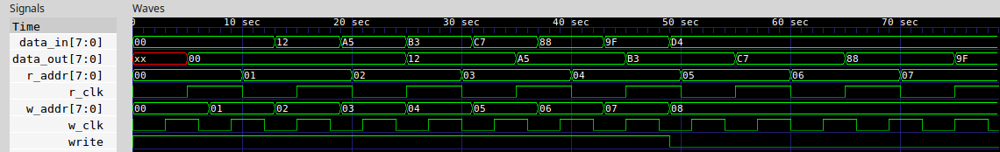

# MEMORIA DUAL PORT

[[_TOC_]]

Fuente:
- https://gitlab.com/RamadrianG/wiki---fpga-para-todos/-/wikis/Memorias
- https://gitlab.com/RamadrianG/wiki---fpga-para-todos/-/wikis/RAM-Dual-Port

## 1. Descripción

### 1.2. Introducción al problema

Muchos diseños digitales emplean algún tipo de **memoria** para almacenar datos, parámetros, instrucciones, etc. A veces se trata de elementos de trabajo internos del dispositivo, y en otras ocasiones son accesibles por el usuario. 

**A nivel RTL**, las memorias pueden interpretarse y manipularse mediante estructuras de datos comunes. Por ejemplo, como vectores de registros:
```verilog
reg[BITS_POR_REGISTRO-1 : 0] MEMORIA[NRO_REGISTROS-1 : 0];
```

**A nivel físico**, en muchos casos las FPGA poseen bloques de memoria internos (es decir, hardware físico que no necesita ser “sintetizado”), cuyo empleo resulta en una optimización del diseño propuesto, ya que aprovecha recursos existentes. Prácticamente todas las FPGA modernas poseen algún tipo de bloque de memoria RAM especialmente dedicado en su interior a este tipo de tareas. El aprovechamiento de estos recursos de hardware provee una doble ventaja:
 - Evita el gasto innecesario de celdas lógicas genéricas, las cuales pueden dedicarse a otras tareas.
 - Proveen una densidad de memoria mucho mayor que si se utilizaran celdas lógicas para almacenar información (lo que se denomina **RAM distribuida**).

Por estas razones es muy importante aprender a diseñar elementos de trabajo basados en memoria y aprovechar los recursos de memoria existentes en la FPGA de ocasión.

Por ejemplo, la FPGA iCE40 posee 4 bloques de 256 kB de RAM que suman un total de 1024 kB. Cada bloque está estructurado en 16 regiones de 16 kB cada una. Los bloques RAM están distribuidos a lo largo de todo el integrado, permitiendo optimizar el P&R del diseño según se requiera.

Para poder utilizar las memorias existentes dentro de la FPGA, los fabricantes proveen ciertas formas recomendadas de describir la entidad y la arquitectura del componente de manera que el sintetizador “interprete” dicha forma de descripción y la asocie directamente a uno de los bloques de memoria internos de la FPGA.

 - Cuando el sintetizador reconoce el uso de la RAM implícitamente en el diseño, esto se denomina **inferencia**.

 - En cambio, si el diseño declara explícitamente el uso de un bloque de RAM, lo hace mediante una **primitiva**.

Por ejemplo, la primitiva asociada a las block RAM de la FPGA iCE40 se instancia como una entidad o modulo más:

```verilog
//VERILOG
SB_SPRAM256KA ramfn_inst1(
.DATAIN(DATAIN),
.ADDRESS(ADDRESS),
.MASKWREN(MASKWREN),
.WREN(WREN),
.CHIPSELECT(CHIPSELECT),
.CLOCK(CLOCK),
.STANDBY(STANDBY),
.SLEEP(SLEEP),
.POWEROFF(POWEROFF),
.DATAOUT(DATAOUT_A)
)
```
Esta dualidad de inferencia vs. primitivas se aplica también a otros recursos que podemos encontrar en una FPGA (por ejemplo, bloques para operaciones aritméticas). 
 - Un diseño basado en la inferencia de recursos debe confiar en que el sintetizador sea suficientemente "inteligente" para asociar el módulo descrito con el recurso de hardware.
 - Por otro lado, una implementación basada en primitivas es menos portable, ya que cada primitiva es propia de cada FPGA, y mudar el diseño a una nueva FPGA implicará reescribir el diseño en términos de las primitivas del nuevo dispositivo.

## Tipos de memorias

Podemos distinguir varios tipos de memorias; los más básicos son:

 - Memorias de Solo Lectura (_Read-Only Memories_, ROM)
 - Memorias de Acceso Aleatorio (_Random Acces Memories_, RAM)
   - De lectura asincrónica
   - De lectura sincrónica
     - Single port
     - Dual port
 - Memorias de Acceso Secuencial
   - FIFO (_First In, First Out_, más conocidas como Colas)
   - LIFO (_Last In, First Out_, más conocidas como Pilas)

### 1.3. Arquitectura o metodología

En este ejemplo veremos el código básico mediante el cual un sintetizador puede inferir el uso de un bloque de memoria RAM y el impacto que la estructura de nuestro código tiene en la estrategia de síntesis.

## 2. Diseño

En este caso emplearemos lo que se conoce como una RAM de doble puerto o "dual port". Recibe este nombre porque puede ser escrita y leída simultáneamente incluso a señales de reloj diferentes. Esto es muy importante porque permite compatibilizar diseños trabajando en diferentes **dominios de reloj.**

Tomemos como ejemplo un procesador digital de señal cuya entrada proviene de un ADC de alta velocidad, como es el caso en muchos instrumentos de medición digitales. Si las señales de entrada se muestrean (producen) a una tasa mucho mayor de lo que la unidad de cálculo puede procesar (consumir), entonces corremos el riesgo de perder información que no llega a ser leída. El uso de una memoria intermedia que pueda ser escrita a una velocidad y leída a otra permite compatibilizar ambos dominios.

### 2.1. Entradas, salidas y parámetros

A continuación describimos la interfaz de nuestro módulo:

```verilog
module RAM_DUAL 

  #(parameter WORD_LENGTH = 8,	//Bits de cada palabra
    parameter ADDR_LENGTH = 8)	//Bits de direcciones

  (input wire w_clk,				            //Write clock
   input wire r_clk,							//Read clock
   input wire write,			                //Write enable
   input unsigned[ADDR_LENGTH-1 : 0] w_addr,	//Write address
   input unsigned[ADDR_LENGTH-1 : 0] r_addr,	//Read address
   input wire[WORD_LENGTH-1 : 0] data_in,		//Dato de entrada
   output reg[WORD_LENGTH-1 : 0] data_out);		//Dato de salida
```

- **Entradas**
  - `w_clk`: Reloj para escritura
  - `r_clk`: Reloj para lectura
  - `write`: Habilitación de escritura
  - `w_addr`: Dirección de escritura
  - `r_addr`: Dirección de lectura
  - `data_in`: Palabra a escribir
- **Salidas**
  - `data_out`: Palabra leída
- **Parámetros**
  - `WORD_LENGTH`: Bits por palabra
  - `ADDR_LENGTH`: Bits de direccionamiento

### 2.2. Vector de registros

Como dijimos antes, se puede modelizar una memoria en Verilog como un vector de registros del tipo:

```verilog
reg[WORD_LENGTH-1:0] MEMORY[2**ADDR_LENGTH-1:0];
```

Cada registro tiene `WORD_LENGTH` bits, mientras que la cantidad total de registros que podemos direccionar con N bits de direccionamiento es:

```math
R = 2^N 
```

Para nuestro caso, N=`ADDR_LENGTH`

### 2.3. Proceso de lectura

A diferencia de los casos más comunes, donde todos los procesos funcionan al flanco de un mismo reloj, en este caso tendremos procesos activados por varios relojes. En primer lugar escribimos el proceso asociado al reloj de lectura. La lógica es bastante simple: se coloca en el registro de salida `data_out` el contenido del registro apuntado por la dirección contenida en `r_addr`.

```verilog
always @(posedge r_clk) begin
    data_out <= MEMORY[r_addr];
end
```

### 2.4. Proceso de escritura

El caso del proceso de escritura es un poco más interesante. En cada flanco del reloj de escritura, si la señal de habilitación de escritura `write` se encuentra en nivel alto, entonces el contenido de la entrada `data_in` se transfiere al registro apuntado por la dirección contenida en `w_addr`.

```verilog
always @(posedge w_clk) begin
    if (write==1'b1) begin
        MEMORY[w_addr] <= data_in;
    end
end
```

## 3. Simulación

Para simular este ejemplo podemos usar la extensión **educiaafpga** en VSCode o el Makefile provisto.
 - Con **VSCode**
   - Abrir un terminal en la carpeta del ejemplo.
   - Tipear `code .`. Esto abre la carpeta en VSCode.
   - Usar **Ctrl+P** para abrir la paleta de comandos.
   - Seleccionar la opción **EDU-CIAA-FPGA: Icarus Verilog from Docker**
   - Usar como archivo principal de diseño `test.v`
   - Usar como archivo de formas de onda de salida `test.vcd`
 - Con el **Makefile**
   - Abrir un terminal en la carpeta del ejemplo.
   - Tipear `make sim`. Esto corre la simulacion y abre GTKWave.

### 3.1. Testbench

#### 3.1.1. Estructura

La estructura del testbench es muy sencilla. En primer lugar proveemos las señales internas que se conectan al DUT:

```verilog
`include "main.v"

module test;
  
  reg wclk;
  reg rclk;
  
  reg [7:0] data_in;
  wire[7:0] data_out;
  
  reg wr_en;
  
  reg[7:0] raddress;
  reg[7:0] waddress;
  
  RAM_DUAL ram(.r_clk(rclk),
               .w_clk(wclk),
               .write(wr_en),
               .w_addr(waddress),
               .r_addr(raddress),
               .data_in(data_in),
               .data_out(data_out));
```

#### 3.1.2. Uso de estímulos externos

En este testbench, en lugar de escribir manualmente los estímulos con lo cuales alimentaremos al DUT, emplearemos un método más sofisticado mediante el cual los valores a guardar en memoria se obtienen a partir de un archivo externo. Más adelante describimos este proceso con detalle, por ahora debemos agregar las siguientes variables al testbench:

```verilog

  //Descriptor de archivo
  integer file;

  //Resultado de fscanf
  integer fscanf_res;
  
```

#### 3.1.3. Actualización de los relojes y la dirección de lectura

Luego definimos el periodo de los relojes de lectura y escritura. En este caso empleamos frecuencias levemente diferentes para uno y otro. El proceso lector es más lento que el escritor, y en cada periodo completo de reloj aumenta en 1 su dirección de lectura. 

```verilog
  
  // Generacion de reloj
  always #5 rclk = !rclk;
  always #3 wclk = !wclk;

  // Actualizacion de la direccion de lectura
  always #10 raddress = raddress + 1;
```

#### 3.1.4. Estado inicial

A continuación definimos el estado inicial del testbench y del DUT:

```verilog
initial begin
    
    $dumpfile("test.vcd");
    $dumpvars(0,test);

    #0 data_in <= 8'h00;
    #0 rclk	   <= 1'b0;
    #0 wclk    <= 1'b0;
    #0 wr_en   <= 1'b1;
    #0 raddress <= 0;
    #0 waddress <= 0;

    ...

```

#### 3.1.5. Lectura de estímulos externos

Verilog ofrece muchas funciones denominadas "llamadas al sistema" (o _system calls_) cuya función es ayudar a que nuestro testbench interactúe con elementos externos. Las system calls inician siempre con el símbolo $, y algunas permiten leer archivos externos. Esto es útil para leer estímulos, configuraciones o señales desde archivos auxiliares en lugar de escribirlos a mano en nuestro código fuente. Las ventajas de este método son varias: el testbench es más sencillo y reusable, los estímulos pueden ser generados por un script adicional, y puede usarse una gran cantidad de estímulos sin que ello implique un incremento en la complejidad del testbench.

En este ejemplo se hace uso de un archivo de estímulos externo llamado `stimulus.txt` con el siguiente contenido por defecto:

```
00
12
A5
B3
C7
88
9F
D4
```

El código que lee estos estímulos se muestra a continuación:

```verilog
// Leer estimulos de un archivo externo
file = $fopen("stimulus.txt","r");

//Verificar el archivo haya sido correctamente abierto
#1 if (!file) begin

    //En caso de error, avisar
    $display("Error al abrir el archivo");

end else begin

    //Mientras no lleguemos al final del archivo
    while (!$feof(file)) begin

        //Cada 3 unidades de tiempo escribir un valor
        #6 fscanf_res = $fscanf(file,"%x",data_in);
        #0 waddress = waddress + 1;
        
    end
end
```

Analicémoslo por partes:
1. Usamos `$fopen` para abrir el archivo externo, obteniendo como resultado un descriptor de archivo. 
2. Si `$fopen` no devuelve 0 es porque hubo un error, y por lo tanto se muestra un mensaje.
3. Una unidad de tiempo después de iniciar la simulación, empezamos a leer lineas del archivo.
4. La funcion `$feof` devuelve 1 si llegamos al final del archivo (EOF, _End Of File_).
5. Si no hemos llegado al final del archivo, leemos una linea y la guardamos en el registro `data_in`.

La funcion `$fscanf` lee una linea y la interpreta de acuerdo a la cadena de formato pasada como segundo argumento. Su uso es identico a la funcion `fscanf()` de C. En este caso, lee la linea entera como un hexadecimal (debido al formateador `%x`) y la guarda en `data_in`.

#### 3.1.6. Fin de la simulación

El último paso es desactivar la escritura de datos, cerrar el archivo de estímulos y terminar la simulación:

```verilog
    #0 wr_en   <= 1'b0;

    //Cerrar archivo y terminar
    #30 $fclose(file);
    $finish;
  end
endmodule
```

### 3.2. Resultados

El siguiente gráfico muestra el comportamiento de la memoria. Se puede ver que el proceso de escritura es más rápido que el de lectura, siendo mayor su frecuencia de reloj como también la velocidad a la que aumenta la dirección de memoria escrita. Por su parte, el proceso lector accede a las posiciones de memoria a medida que avanza a ritmo constante, leyendo lo que ya fue escrito desde el archivo de estímulos.



## 4.1. Implementación

En este caso la implementacion solo sirve para ver el reporte de síntesis y de Place and Route generados por el toolchain utilizado. El diseño no solo usa gran cantidad de pines, sino también tiene dos clocks diferentes. Por lo tanto, vamos a obviar su prueba directa en la placa. No obstante, en otro ejemplo posterior veremos como utilizar efectivamente este dispositivo en la EDU-CIAA-FPGA.

Nuevamente podemos usar VSCode o el Makefile para sintetizar el diseño:
 - Con **VSCode**
   - Abrir un terminal en la carpeta del ejemplo.
   - Tipear `code .`. Esto abre la carpeta en VSCode.
   - Usar **Ctrl+P** para abrir la paleta de comandos.
   - Seleccionar la opción **EDU-CIAA-FPGA: Verilog Toolchain from Docker**
   - Usar como archivo principal de diseño `main.v`
   - Usar como archivo de pines `pins.pcf`
 - Con el **Makefile**
   - Abrir un terminal en la carpeta del ejemplo.
   - Tipear `make syn`. Esto corre la cadena de implementación completa.

### 4.2.1. Resultados

En la terminal o en el archivo de salida de VSCode, según cómo hayamos ejecutado la implementación, encontraremos una gran cantidad de reportes, estadísticas y mediciones de cómo nuestro diseño ha sido sintetizado y cómo sus componentes dentro de la FPGA han sido conectados. Por ejemplo, uno de los reportes más importantes son las estadísticas de utilización del dispositivo. 

Este reporte es generado por el sintetizador y muestra, entre otras cosas, que ha **inferido** el uso de un bloque **SB_RAM40_4K** de memoria RAM, sin que nosotros hayamos explicitado el uso de dicha primitiva:
```
=== RAM_DUAL ===

   Number of wires:                  8
   Number of wire bits:             51
   Number of public wires:           8
   Number of public wire bits:      51
   Number of memories:               0
   Number of memory bits:            0
   Number of processes:              0
   Number of cells:                  1
     SB_RAM40_4K                     1
```

El Place and Route, por su parte, muestra que además del bloque RAM se han consumido **solamente 2 celdas lógicas de las 7680 disponibles**. Esto se debe a que toda la lógica de control que hemos especificado en el RTL ya se encuentra embebida en la primitiva de la RAM usada. Es decir, **los bloques RAM de la FPGA ICE40 son Dual-Port por defecto.** Vemos también el consumo de celdas de entrada y salida comunes (**SB_IO**) y de tipo _global buffer_ (**SB_GB**), estos últimos empleados especialmente a la propagación de señales de reloj.

```
Info: Device utilisation:
Info:            ICESTORM_LC:     2/ 7680     0%
Info:           ICESTORM_RAM:     1/   32     3%
Info:                  SB_IO:    35/  256    13%
Info:                  SB_GB:     2/    8    25%
Info:           ICESTORM_PLL:     0/    2     0%
Info:            SB_WARMBOOT:     0/    1     0%
```

# 5. Ejercicios adicionales

1. **¿Tendría sentido emplear una RAM donde lectura y escritura funcionen con el mismo reloj?**
2. **¿Tendría sentido emplear una RAM en un sistema donde el lector es más rápido que el escritor?**
3. **¿Se puede sintetizar el diseño para cualquier valor?.** Probar variar los valores por defecto de longitud de palabra y lognitud de direcciones. Se recomienda usar por ejemplo valores impares. ¿Cómo varía el consumo de bloques RAM y celdas lógicas?.
4. **Modificar el testbench para que tome una lista de pares donde el primer elemento es el dato y el segundo su dirección de memoria.** Por ejemplo:
```
A3,12
54,03
6F,2D
...
```
**¿Qué cambios habría que hacer para poder leer esos valores correctamente en el testbench?**