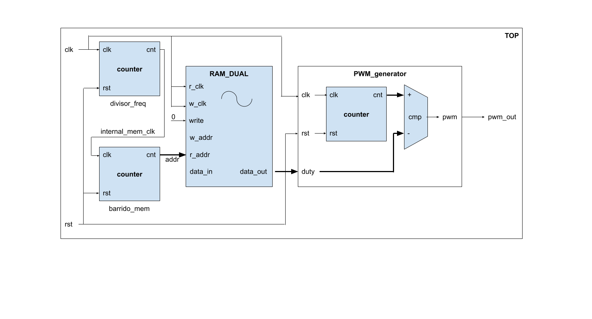

# Modulador SPWM

[[_TOC_]]

## 1. Descripción

### 1.2. Introducción al problema

En este ejemplo seguiremos jugando con los conceptos de diseño jerárquico, inferencia de hardware e instanciación de primitivas para construir un modulador SPWM. Antes de continuar, vamos a introducir brevemente los conceptos de **ciclo de trabajo**, modulación **PWM** y **SPWM**.

#### 1.2.1. Ciclo de trabajo

Dada una señal o forma de onda periódica rectangular, se denomina **ciclo de trabajo o de actividad** (_duty cycle_) a la fracción de tiempo que dicha señal permanece en el estado alto. Si durante un periodo de duración T la señal está en nivel alto un tiempo Ton, entonces el ciclo de trabajo será:


La siguiente figura muestra una señal cuadrada con un ciclo de actividad del 50%. Es decir, que transcurre tanto tiempo en estado alto como bajo:


#### 1.2.2. PWM

Se puede demostrar que si la amplitud máxima de la señal cuadrada a(t) es A, entonces su valor medio será:


Esto nos indica que si disponemos de una fuente de amplitud (por ejemplo tensión, corriente, etc.) constante, podemos emplearla para generar una señal cuadrada mediante la cual es posible regular o controlar el valor medio entregado simplemente cambiando el ciclo de trabajo. Esto es lo que se conoce como **modulación por ancho de pulsos** o PWM (_pulse width modulation_). Se trata de una técnica muy utilizada en sistemas de control, comunicaciones y electrónica de potencia ya que con pocos componentes es fácil abrir y cerrar el paso de una señal de acuerdo a un ciclo de actividad dado. 

La siguiente figura ilustra cómo varía el ciclo de actividad (arriba) de la señal cuadrada (abajo):


#### 1.2.3. SPWM

Si el ciclo de actividad es variable con el tiempo, entonces puede tomar una nueva forma de onda de acuerdo a la variación que queramos. Un caso típico es emplear una variación senoidal del ciclo de trabajo, realizando lo que se conoce como **modulación pr ancho de pulso senoidal** o SPWM (_sine pulse width modulation_). En esta técnica, la forma de onda del ciclo de trabajo viene dada por:


Donde $`\omega`$ es la velocidad angular con la cual se mueve el ciclo de trabajo. La siguiente figura muestra la forma de onda del ciclo de actividad y el efecto sobre la señal modulada:


La modulación SPWM es fundamental en convertidores DC/AC de potencia, ya que a partir de un nivel continuo permiten crear variaciones senoidales de tensión y generar formas de onda de corriente alterna. 

### 1.3. Arquitectura o metodología

En este ejemplo vamos a construir de forma incremental un modulador SPWM, el cual consiste de:
1. Una memoria con una forma de onda senoidal precargada
2. Un contador actuando como divisor de frecuencia para barrer la memoria
3. Un contador de pulsos de reloj
4. Un comparador

El mecanismo es bastante sencillo: el comparador contrasta la cantidad de pulsos de reloj acumulados en el actual periodo contra el ciclo de actividad indicado por la memoria. Si el número de pulsos acumulado es mayor al especificado, la salida se coloca en un nivel bajo. El divisor provee un barrido de memoria a menor frecuencia que la principal, de forma que para cada valor de ciclo de actividad se pueda obtener una modulación más precisa. 

## 2. Diseño

### 2.1. Memoria

El dispositivo de memoria es una RAM dual port, exactamente igual a la analizada en el ejercicio anterior, en la cual ambos puertos (lectura y escritura) trabajan en un mismo dominio de reloj. Se puede apreciar la llamada a sistema **$readmemh**, la cual le indica al simulador o al sintetizador que la memoria inicia con un conjunto de datos precargados. Los valores iniciales están almacenados en el archivo **mem_data.mem**, y constituyen un período senoidal en formato hexadecimal.

```verilog
module RAM_DUAL 

  #(parameter WORD_LENGTH = 8,	//Bits de cada palabra
    parameter ADDR_LENGTH = 8)	//Bits de direcciones

  (input wire w_clk,				            //Write clock
   input wire r_clk,							//Read clock
   input wire write,			                //Write enable
   input [ADDR_LENGTH-1 : 0] w_addr,	        //Write address
   input [ADDR_LENGTH-1 : 0] r_addr,	        //Read address
   input wire [WORD_LENGTH-1 : 0] data_in,		//Dato de entrada
   output reg [WORD_LENGTH-1 : 0] data_out);    //Dato de salida
  
  //Bloque de memoria (** denota potencia)
  reg[WORD_LENGTH-1:0] MEMORY[2**ADDR_LENGTH-1:0];

  //LEER EL CONTENIDO DE LA MEMORIA DESDE UN ARCHIVO .mem
    initial begin
        $readmemh("mem_data.mem", MEMORY);
    end
  
  // Lectura (dominio w_clk)
  always @(posedge w_clk) begin
    if (write==1'b1) begin
      MEMORY[w_addr] <= data_in;
    end
  end
  
  //Escritura (dominio r_clk)
  always @(posedge r_clk) begin
    data_out <= MEMORY[r_addr];
  end

endmodule
```

### 2.2. Contadores

Los contadores de ciclo de trabajo y barrido de memoria son dos instancias de un mismo modulo, que se muestra debajo:

```verilog
//Parametros y E/S
module counter #(parameter N_bits = 4) (

    //Clock y reset
    input  wire clk,
    input  wire rst,

    //Estado del contador
    output reg[N_bits-1:0] count
);

//Proceso asincronico
always @(posedge clk or posedge rst) begin
    if (rst == 1'b1) begin
        count <= 0;
    end else begin
        count <= count + 1;
    end
end

endmodule //counter
```

### 2.3. Comparador / modulador PWM

El modulador PWM es un comparador equipado con un contador interno. El nivel de salida es alto hasta que la cuenta interna alcanza al valor de ciclo de actividad que entra al modulador (por ejemplo desde la memoria). Luego, vuelve a nivel bajo hasta que se reinicia la cuenta debido al overflow del propio contador.

```verilog

//Parametros y E/S
module PWM_generator #(parameter N_bits = 8) (

    // Clock y reset
    input wire clk,
    input wire rst,

    // Duty cycle
    input wire[N_bits-1 : 0] duty,

    // Salida
    output wire PWM_out
);

//Conexiones del contador interno
wire[N_bits-1 : 0] int_cnt_conn;

//Instanciar contador interno
counter int_cnt (.clk(clk),.rst(rst),.count(int_cnt_conn));
defparam int_cnt.N_bits = N_bits;

//Comparador de salida
assign PWM_out = (int_cnt_conn < duty)?(1'b1):(1'b0);

endmodule //PWM_generator
```

### 2.4. Modulador SPWM

Aqui es donde se combinan todos los elementos previos: un divisor de alto numero de cuentas reduce el clock al valor requerido para que el ciclo de trabajo varie de forma acorde a la precision requerida. Este reloj dividido alimenta al contador que barre toda la memoria RAM. La salida de la memoria es el ciclo de trabajo que alimenta al modulador PWM, que emplea a su vez el reloj original (sin dividir) de alta frecuencia para generar los pulsos:

```verilog
module spwm (
    input wire clk,
    input wire rst,
    output wire pwm_out,
    output wire[2:0] dummy
);

// Negar entrada reset
wire global_rst;
assign global_rst = ~rst;

// Anular los otros 3 LEDs
assign dummy = 3'b000;

// Parametros internos del modulo
parameter MEM_CLK_DIVIDER_BITS = 19;
parameter ADDRESS_BITS  = 8;
parameter MEM_WORD_BITS = 8;

// Linea interna de clock para barrido de memoria
wire[MEM_CLK_DIVIDER_BITS-1:0] internal_mem_clk;

// Direccion de memoria de lectura
wire[ADDRESS_BITS-1:0] addr;

// Duty cycle interno
wire[MEM_WORD_BITS-1:0] dc;

////// Instanciar y conectar componentes

// Instanciar divisor de frecuencia para obtener un clock de 190 Hz
counter divisor_freq(.clk(clk),
                     .rst(global_rst),
                     .count(internal_mem_clk));
defparam divisor_freq.N_bits = MEM_CLK_DIVIDER_BITS;

// Instanciar contador para el barrido de la memoria
counter barrido_mem(.clk(internal_mem_clk[MEM_CLK_DIVIDER_BITS-1]),
                    .rst(global_rst),
                    .count(addr));
defparam barrido_mem.N_bits = ADDRESS_BITS;

// Instanciar memoria RAM
RAM_DUAL my_ram(.r_clk(clk),
               .w_clk(clk),
               .write(1'b0),
               .w_addr(addr),
               .r_addr(addr),
               .data_in(),
               .data_out(dc));

defparam my_ram.WORD_LENGTH = MEM_WORD_BITS;
defparam my_ram.ADDR_LENGTH = ADDRESS_BITS;

// Instanciar generador PWM
PWM_generator pwm(.clk(clk),
                  .rst(global_rst),
                  .duty(dc),
                  .PWM_out(pwm_out));
defparam pwm.N_bits = MEM_WORD_BITS;

endmodule
```

El diagrama en bloques del conjunto hasta este punto es:



### 2.5. PLL

Como vemos, hay muchos dispositivos que dependen de la estabilidad del reloj suministrado. En general no se considera adecuado conectar el clock externo directamente al sistema, sino a traves de un elemento de hardware llamado PLL o **Phase Locking Loop**. El PLL puede tomar una señal de reloj y acondionarla para multiplicar o dividir la frecuencia a la vez que se permite el manejo de una gran cantidad de dispositivos. Esto se denomina "mejorar el _fan out_". Cada FPGA suele tener al menos uno de estos PLL, y cada fabricante provee herramientas diferentes para su configuración. En general no se pueden tratar por inferencia, sino que deben instanciarse **como primitivas**. 

En este diseño, se implementa un PLL que **solo se utilizará para el proceso de síntesis** y no para la simulación del sistema. Esto no nos afecta funcionalmente ya que el PLL solo aumenta o reduce la frecuencia de reloj de entrada. Abajo se muestra el código empleado para instanciar el PLL y el buffer de entrada para la señal de clock externa. La referencia acerca de los parámetros y terminales del PLL (y de cualquier otra primitiva) puede verse en el **Manual de Usuario de la FPGA iCE40**:

```verilog
module pll(
	input  wire clock_in,   // Clock de entrada
	output wire global_out, // Clock de salida
	output wire locked      // PLL enganchado
);

wire clock_int; // Linea auxiliar interna
    
// Instanciar la primitiva del PLL (parametros y puertos)
SB_PLL40_CORE #(
	.FEEDBACK_PATH("SIMPLE"), // Realimentación simple
	.DIVR(4'b0000),		      // DIVR =  0
	.DIVF(7'b1000010),	      // DIVF =  66
	.DIVQ(3'b011),		      // DIVQ =  3
	.FILTER_RANGE(3'b001)     // Filtro de salida
) uut (
	.LOCK(locked),            // Indicador de PLL bloqueado
	.RESETB(1'b1),            // Linea de reset (activa en bajo)
	.BYPASS(1'b0),            // Sin Bypass
	.REFERENCECLK(clock_in),  // Clock de referencia (desde cristal externo)
    .PLLOUTGLOBAL(clock_int)  // Clock de salida (conectado a linea auxiliar)
	);

// Instanciar la primitiva del Buffer Global
SB_GB sbGlobalBuffer_inst( .USER_SIGNAL_TO_GLOBAL_BUFFER(clock_int) // Entrada
		                , .GLOBAL_BUFFER_OUTPUT(global_out) );      // Salida
endmodule // PLL
```

Se observa el uso de un **Buffer Global**. El objetivo de este bloque es aumentar la cantidad de corriente que la señal de reloj puede proveer, y por lo tanto la cantidad de compuertas que puede conmutar. Recordemos que la señal de reloj normalmente debe alimentar a todo el sistema, razón por la cual su capacidad de manejo de carga, denominada *fan-out*, es crítica. El uso de bloques de tipo buffer mejora dicho parámetro, evitando una excesiva pérdida de nivel en el clock o reduciendo los retardos de conmutación y propagación en la red de reloj.

Agregando el PLL al modulador SPWM, el sistema a top-level resulta:

```verilog
module top (
    input wire clk,
    input wire rst,
    output wire pwm_out,
    output wire[2:0] dummy
);

////// Instanciar y conectar componentes

// Linea interna de clock a 100 MHz
wire internal_clk;

// Instanciar PLL a 100 MHz
pll my_pll(.clock_in(clk),
           .global_out(internal_clk),
           .locked());

spwm my_spwm(.clk(internal_clk),
             .rst(rst),
             .pwm_out(pwm_out),
             .dummy(dummy));

endmodule
```

## 3. Simulación

Para simular este ejemplo podemos usar la extensión **educiaafpga** en VSCode o el Makefile provisto.
 - Con **VSCode**
   - Abrir un terminal en la carpeta del ejemplo.
   - Tipear `code .`. Esto abre la carpeta en VSCode.
   - Usar **Ctrl+P** para abrir la paleta de comandos.
   - Seleccionar la opción **EDU-CIAA-FPGA: Icarus Verilog from Docker**
   - Usar como archivo principal de diseño `test.v`
   - Usar como archivo de formas de onda de salida `test.vcd`
 - Con el **Makefile**
   - Abrir un terminal en la carpeta del ejemplo.
   - Tipear `make sim`. Esto corre la simulacion y abre GTKWave.

### 3.1. Testbench

El testbench en si mismo es muy sencillo: solo consiste en la instanciacion del dispositivo bajo prueba (DUT) y el estimulo con un clock fijo para obtener la modulacion SPWM a la salida. Tenemos en primer lugar la inclusion e instanciacion del modulador SPWM:

```verilog
`include "main.v"

module test;

// Estimulos
reg clk;
reg rst;
wire pwm_out;
wire[2:0] dummy;

// DUT
spwm dut(  
    .clk(clk),
    .rst(rst),
    .pwm_out(pwm_out),
    .dummy(dummy)
);

// Reducir la division de frecuencia
defparam dut.MEM_CLK_DIVIDER_BITS = 4;

// Generacion clock
always #1 clk = !clk;
```

Y luego el registro de valores

```verilog
initial begin
    $dumpfile("test.vcd");
    $dumpvars(0,test); //Abrir archivo

    #0 rst <= 1'b0;
    #0 clk <= 1'b0;
    #2 rst <= 1'b1; // RST NEGADO !!

    #32768 $finish;
end

endmodule
```

### 3.2. Resultados

La siguiente imagen muestra el resultado de la simulacion. Se puede ver en la parte superior el ciclo de trabajo que se mueve senoidalmente de acuerdo a lo cargado en la memoria y en la parte inferior la modulacion obtenida. Para obtener este formato de graficos se recomienda usar los siguientes controles de GTKWave:
1. Incluir la señal **dc** interna del **dut**
2. Click derecho sobre ella, ir a **Data Format / Analog / Interpolation**. Esto transforma el formato binario a una señal continua.
3. Click derecho nuevamente y usar **Insert Height Analog Expression** para aumentar la amplitud de la señal y así visualizarla mejor.
4. Agregar la señal **pwm_out** que contiene la forma de onda modulada.


## 4. Implementación

En este caso la implementacion no parte del archivo **main.v** sino del **top.v**, que incluye el PLL ademas del modulador SPWM:

Nuevamente podemos usar VSCode o el Makefile para sintetizar el diseño. Recordar conectar la placa EDU-CIAA-FPGA a la computadora antes de lanzar el proceso de síntesis:
 - Con **VSCode**
   - Abrir un terminal en la carpeta del ejemplo.
   - Tipear `code .`. Esto abre la carpeta en VSCode.
   - Usar **Ctrl+P** para abrir la paleta de comandos.
   - Seleccionar la opción **EDU-CIAA-FPGA: Verilog Toolchain from Docker**
   - Usar como archivo principal de diseño `top.v`
   - Usar como archivo de pines `pins.pcf`
 - Con el **Makefile**
   - Abrir un terminal en la carpeta del ejemplo.
   - Tipear `make syn`. Esto corre la cadena de implementación completa.

### 4.1. Síntesis

El sintetizador ejecuta una gran cantidad de chequeos orientados a reconocer ciertos patrones, tales como memorias o maquinas de estado, a fines de proveer una mejor representacion de los mismos. Por ejemplo, el siguiente extracto del log de sintesis muestra los pasos del chequeo mediante el cual Yosys infiere que nuestra RAM_DUAL puede implementarse con una de las Block RAM de la FPGA:

```2.24. Executing MEMORY_BRAM pass (mapping $mem cells to block memories).
Processing top.my_spwm.my_ram.MEMORY:
  Properties: ports=2 bits=2048 rports=1 wports=1 dbits=8 abits=8 words=256
  Checking rule #1 for bram type $__ICE40_RAM4K_M0 (variant 1):
    ...
  Checking rule #2 for bram type $__ICE40_RAM4K_M0 (variant 1):
   ...
  Checking rule #3 for bram type $__ICE40_RAM4K_M0 (variant 1):
   ...
  Selecting best of 4 rules:
    Efficiency for rule 4.3: efficiency=12, cells=4, acells=1
    Efficiency for rule 4.2: efficiency=25, cells=2, acells=1
    Efficiency for rule 4.1: efficiency=50, cells=1, acells=1
    Efficiency for rule 1.1: efficiency=50, cells=1, acells=1
    Selected rule 4.1 with efficiency 50.
    
    Mapping to bram type $__ICE40_RAM4K_M123 (variant 1):
      Write port #0 is in clock domain \my_pll.global_out.
        Mapped to bram port B1.
      Read port #0 is in clock domain \my_pll.global_out.
        Mapped to bram port A1.1.
      Creating $__ICE40_RAM4K_M123 cell at grid position <0 0 0>: my_spwm.my_ram.MEMORY.0.0.0

```

Otras tareas del sintetizador incluyen eliminar nodos no utilizados (por ejemplo, debido a entradas/salidas flotantes o simplificaciones logicas) y otras optmizaciones de diseño orientadas a reducir el consumo de recursos.

#### 4.1.1 Consumo de recursos (síntesis)

El consumo de recursos estimado por la síntesis es:

```
=== top ===

   Number of wires:                 43
   Number of wire bits:            246
   Number of public wires:          43
   Number of public wire bits:     246
   Number of memories:               0
   Number of memory bits:            0
   Number of processes:              0
   Number of cells:                120
     SB_CARRY                       37
     SB_DFFR                        35
     SB_GB                           1
     SB_LUT4                        45
     SB_PLL40_CORE                   1
     SB_RAM40_4K                     1
```

Vemos que ya aparecen el PLL, la BRAM y unas 120 de las casi 8000 celdas que dispone la FPGA. 

### 4.2. Place and Route

El algoritmo de Placement (es decir, determinación de qué celdas del dispositivo se van a usar para implementar las funciones lógicas definidas por el paso de síntesis) comienza colocando aquellas celdas cuya posición se encuentra definida por su cercanía a los pines de IO descritos en el archivo PCF. Luego, se realizan diversas iteraciones sobre un placement aleatorio inicial, tras las cuales se llega a un placement "óptimo" para el diseño requerido.

```
Info: Placed 9 cells based on constraints.
Info: Creating initial analytic placement for 23 cells, random placement wirelen = 1227.
Info:     at initial placer iter 0, wirelen = 153
Info:     at initial placer iter 1, wirelen = 146
Info:     at initial placer iter 2, wirelen = 146
Info:     at initial placer iter 3, wirelen = 146
Info: Running main analytical placer.
Info:     at iteration #1, type SB_GB: wirelen solved = 144, spread = 147, legal = 178; time = 0.00s
Info:     at iteration #1, type ICESTORM_LC: wirelen solved = 168, spread = 262, legal = 267; time = 0.00s
Info:     at iteration #1, type ICESTORM_RAM: wirelen solved = 228, spread = 228, legal = 381; time = 0.00s
Info:     at iteration #1, type ALL: wirelen solved = 147, spread = 238, legal = 326; time = 0.00s
Info:     at iteration #2, type SB_GB: wirelen solved = 307, spread = 310, legal = 353; time = 0.00s
Info:     at iteration #2, type ICESTORM_LC: wirelen solved = 227, spread = 243, legal = 252; time = 0.00s
Info:     at iteration #2, type ICESTORM_RAM: wirelen solved = 245, spread = 245, legal = 252; time = 0.00s
Info:     at iteration #2, type ALL: wirelen solved = 155, spread = 181, legal = 351; time = 0.00s
Info:     at iteration #3, type SB_GB: wirelen solved = 330, spread = 332, legal = 379; time = 0.00s
Info:     at iteration #3, type ICESTORM_LC: wirelen solved = 255, spread = 272, legal = 279; time = 0.00s
Info:     at iteration #3, type ICESTORM_RAM: wirelen solved = 252, spread = 252, legal = 298; time = 0.00s
Info:     at iteration #3, type ALL: wirelen solved = 147, spread = 182, legal = 312; time = 0.00s
Info:     at iteration #4, type SB_GB: wirelen solved = 290, spread = 293, legal = 336; time = 0.00s
Info:     at iteration #4, type ICESTORM_LC: wirelen solved = 251, spread = 259, legal = 269; time = 0.00s
Info:     at iteration #4, type ICESTORM_RAM: wirelen solved = 251, spread = 251, legal = 297; time = 0.00s
Info:     at iteration #4, type ALL: wirelen solved = 156, spread = 187, legal = 378; time = 0.00s
Info:     at iteration #5, type SB_GB: wirelen solved = 331, spread = 335, legal = 355; time = 0.00s
Info:     at iteration #5, type ICESTORM_LC: wirelen solved = 234, spread = 250, legal = 257; time = 0.00s
Info:     at iteration #5, type ICESTORM_RAM: wirelen solved = 242, spread = 242, legal = 257; time = 0.00s
Info:     at iteration #5, type ALL: wirelen solved = 146, spread = 186, legal = 336; time = 0.00s
Info:     at iteration #6, type SB_GB: wirelen solved = 312, spread = 315, legal = 359; time = 0.00s
Info:     at iteration #6, type ICESTORM_LC: wirelen solved = 260, spread = 276, legal = 287; time = 0.00s
Info:     at iteration #6, type ICESTORM_RAM: wirelen solved = 261, spread = 261, legal = 277; time = 0.00s
Info:     at iteration #6, type ALL: wirelen solved = 155, spread = 185, legal = 336; time = 0.00s
Info:     at iteration #7, type SB_GB: wirelen solved = 312, spread = 315, legal = 336; time = 0.00s
Info:     at iteration #7, type ICESTORM_LC: wirelen solved = 231, spread = 247, legal = 267; time = 0.00s
Info:     at iteration #7, type ICESTORM_RAM: wirelen solved = 251, spread = 251, legal = 282; time = 0.00s
Info:     at iteration #7, type ALL: wirelen solved = 155, spread = 187, legal = 325; time = 0.00s
Info:     at iteration #8, type SB_GB: wirelen solved = 304, spread = 322, legal = 325; time = 0.00s
Info:     at iteration #8, type ICESTORM_LC: wirelen solved = 232, spread = 256, legal = 262; time = 0.00s
Info:     at iteration #8, type ICESTORM_RAM: wirelen solved = 246, spread = 246, legal = 288; time = 0.00s
Info:     at iteration #8, type ALL: wirelen solved = 152, spread = 187, legal = 320; time = 0.00s
Info: HeAP Placer Time: 0.06s
Info:   of which solving equations: 0.04s
Info:   of which spreading cells: 0.01s
Info:   of which strict legalisation: 0.00s
```

Luego se realizan las iteraciones de Routing, para las cuales el objetivo es reducir el retardo de propagación de las señales a lo largo de caminos críticos tales como relojes y líneas de reset.


#### 4.2.1. Consumo de recursos final

Al final del P&R se obtiene el consumo final de recursos de la FPGA. Se han empleado menos del 1% de las celdas lógicas de la FPGA, valor que seguramente hubiera sido mayor si no se usara la ICESTORM_RAM para almacenar la forma de onda senoidal (en tal caso se consumirían celdas lógicas solo para almacenar esa información). Por otro lado se ha usado uno de los dos PLLs disponibles.

```
Info: Device utilisation:
Info:            ICESTORM_LC:    60/ 7680     0%
Info:           ICESTORM_RAM:     1/   32     3%
Info:                  SB_IO:     6/  256     2%
Info:                  SB_GB:     4/    8    50%
Info:           ICESTORM_PLL:     1/    2    50%
Info:            SB_WARMBOOT:     0/    1     0%
```

#### 4.2.3. Limitaciones de reloj

Al final del reporte de P&R típicamente encontramos análisis de tiempos de propagación para las señales más importantes del diseño. Por ejemplo, para la señal **internal_clk** que transporta el reloj del PLL al resto de los submódulos del sistema, se ha determinado una frecuencia máxima de 221.43 MHz, y un retardo de propagación del flanco ascendente de 4.79 ns.

```Info: Max frequency for clock                          'internal_clk': 221.43 MHz (PASS at 12.00 MHz)
Info: Max frequency for clock 'my_spwm.internal_mem_clk[18]_$glb_clk': 365.23 MHz (PASS at 12.00 MHz)

Info: Max delay <async>                                       -> posedge internal_clk                         : 4.79 ns
Info: Max delay <async>                                       -> posedge my_spwm.internal_mem_clk[18]_$glb_clk: 4.79 ns
Info: Max delay posedge internal_clk                          -> <async>                                      : 7.48 ns
Info: Max delay posedge my_spwm.internal_mem_clk[18]_$glb_clk -> posedge internal_clk                         : 1.23 ns
```

### 4.3. Resultado final

La siguiente imagen muestra la variación senoidal del LED empleado como salida, debido a la modulación aplicada. PWM es una técnica eficaz para simular variaciones continuas o analógicas de parámetros eléctricos.


## 5. Ejercicios adicionales

1. Modificar el archivo de valores iniciales en memoria para que el ciclo de trabajo siga una forma de onda de rampa.
2. La modulación SPWM expuesta es aplicable a sistemas monofásicos, pero no a trifásicos donde se necesitan tres ondas con un desfasaje de 120°. La solución es emplear tres moduladores SPWM independientes, cada uno de los cuales tiene una forma de onda precargada con un desfasaje característico. Se propone como ejercicio modificar el diseño propuesto para obtener un modulador SPWM trifásico. Como ayuda se provee la carpeta **3ph** dentro de la cual se encuentran los archivos de memoria con las ondas senoidales desfasadas. A su vez se recomienda emplear un único PLL para los tres canales y parametrizar el módulo RAM_DUAL para poder indicarle qué archivo de memoria cargar en cada caso, tal como se muestra a continuación:

```verilog
// Nombre del archivo de memoria como parametro
module RAM_DUAL 
  #(parameter WORD_LENGTH = 8, // Bits de cada palabra
    parameter ADDR_LENGTH = 8, // Bits de direcciones
    parameter MEM_FILE = "")   // Archivo de valores iniciales en memoria	

    ...

  // Carga de valores iniciales
  initial begin
    if (MEM_FILE != "") begin
        $readmemh(MEM_FILE, MEMORY);
    end
  end

  ...

  // Al instanciar en el nivel superior
  defparam my_ram.MEM_FILE = "mem_data_0.mem";
```